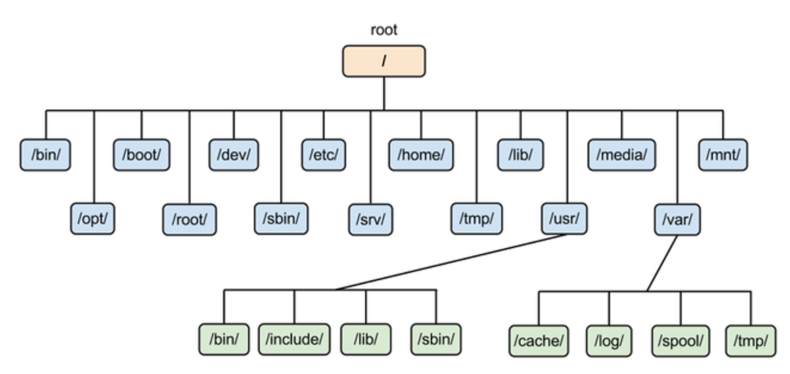
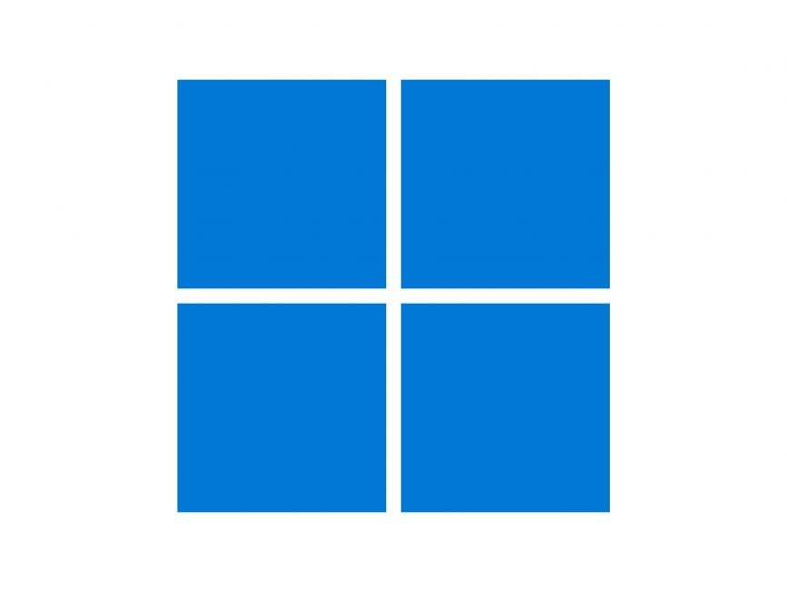

# Files

---

# Bibliography
for this section

1. **Brian Ward**, *How LINUX Works*, 3<sup>rd</sup> Edition, No Starch Press, 2021
    - Chapter 2 - *Basic Commands and Directory Hierarchy*
      - Section 2.19

2. **Razvan Deaconescu, Razbvan Rughinis, Mihai Carabas, Alexandru Radovici**, *Utilizarea Sistemelor de Operare*, Printech 2021, [download](https://github.com/systems-cs-pub-ro/carte-uso/releases/download/uso-ed1-2021/uso.pdf)
    - Chapter 2 - *Utilizarea sistemului de fișiere*
      - Sections 2.1

---

# Windows Filesystem Layout

- Hierarchical structure starting from **drive letters** (`C:\`, `D:\`, etc.)
- Each partition is an **independent filesystem**
- Uses **backslashes (`\`)** and is **case-insensitive** by default

``` {*}{lines: false}
C:\
├── Windows
│   ├── system32
│   └── ...
├── Program Files
│   ├── App1
│   └── App2
├── Users
│   ├── Alice
│   ├── Bob
│   └── Public
└── Temp
```

---

# Linux (POSIX) Filesystem Layout



⚠️ no drive letters, **one single root**

---

# Linux (POSIX) Filesystem Layout Explained

```plaintext {none|1|2,16|3|4|5|6|7|8-10|11-12|13|14,17|15|18|19-22|23|all}
/
├── bin        → Essential user binaries (e.g., ls, cp)
├── boot       → Kernel and boot loader files
├── dev        → Device files (e.g., /dev/sda, /dev/null)
├── etc        → System configuration files
├── home       → User directories (e.g., /home/alice)
├── lib        → Shared libraries for binaries
├── media      → Mount points for removable media
│   ├── cdrom  → CD/DVD mount point
│   └── usb    → USB mount point
├── mnt        → Temporary mount points for devices
│   └── temp   → Temporary device mounts
├── opt        → Optional application packages
├── proc       → Virtual filesystem for system info (kernel, processes)
├── root       → Home directory for the root user
├── sbin       → System binaries (admin commands like shutdown)
├── sys        → Virtual filesystem for kernel objects
├── tmp        → Temporary files
├── usr        → Secondary hierarchy for user applications and files
│   ├── bin    → Non-essential user binaries
│   ├── lib    → Libraries for /usr/bin and /usr/sbin
│   └── share  → Architecture-independent data
├── var        → Variable data (logs, mail, spool files)
```

---
layout: section
---
# Path
absolute and relative

---

# Bibliography
for this section

1. **Brian Ward**, *How LINUX Works*, 3<sup>rd</sup> Edition, No Starch Press, 2021
    - Chapter 2 - *Basic Commands and Directory Hierarchy*
      - Section 2.4
2. **Razvan Deaconescu, Razbvan Rughinis, Mihai Carabas, Alexandru Radovici**, *Utilizarea Sistemelor de Operare*, Printech 2021, [download](https://github.com/systems-cs-pub-ro/carte-uso/releases/download/uso-ed1-2021/uso.pdf)
    - Chapter 2 - *Utilizarea sistemului de fișiere*
      - Sections 2.1

---
---
# What Is a Path?

A **path** tells the operating system *where a file or folder is*.

Two main types:
- **Absolute paths** — start from the root of the filesystem
- **Relative paths** — start from your *current directory*

<br>

💡every running application has one single *current directory* at a time

---

# Absolute Path
full path

Show the **complete location** of a file

<div grid="~ cols-2 gap-5">

<div>

###  Windows

Always start from a **drive letter**

```cmd
C:\Users\Alice\Documents\report.docx
D:\Music\Rock\song.mp3
```

</div>

<div>

###  Linux (POSIX)

Always start from the **root directory /**

```bash
/home/alice/Documents/report.txt
/var/log/syslog
/usr/bin/python3
```

</div>

</div>

---

# Relative Path
to the current directory

- ✅ Shorter
- ⚠️ Depends on where you are

<br>

<div grid="~ cols-2 gap-5">

<div>

###  Windows

Does **NOT** start from a **drive letter**

```cmd
# If you're in C:\Users\Alice
Documents\report.docx
```

</div>

<div>

###  Linux (POSIX)

Does **NOT** start from the **root directory /**

```bash
# If you're in /home/alice
Documents/report.txt
```

</div>

</div>

---

# Special Path Symbols in Windows and Linux (POSIX)

<v-clicks>

| Meaning |  Windows |  Linux (POSIX) | Notes |
|--|--|--|--|
| Current directory | `.` | `.` | Refers to the folder you are currently in |
| Parent directory | `..` | `..` | Moves one level up in the hierarchy |
| Directory separator | `\` | `/` | Used to separate folder names in a path |
| Root directory | Drive letter + `\` (e.g. `C:\`) | `/` | Top-level directory in the filesystem |

</v-clicks>

⚠️ `\` in POSIX systems is used for esacping characters

---
---

# 🧩 Path Syntax Quiz

Windows or Linux

<v-clicks>

| Path | OS? | Valid? | Why? |
|:--|:--|:--|:--|
| `C:\Users\Alice\Documents\notes.txt` |  | ✅ | Uses drive letter and backslashes |
| `/home/alice/Documents/notes.txt` |  | ✅ | Starts from root `/` |
| `..\Pictures\vacation.jpg` |  | ✅ | Relative path in Windows |
| `../Downloads/report.pdf` |  | ✅ | Relative path in Linux |
| `C:/Program Files/App` |  | ✅ | Windows also accepts `/` in many cases |
| `~\Downloads` |  | ❌ | `~` only expands in Linux |
| `~/Music/song.mp3` |  | ✅ | Home directory shortcut in Linux |

</v-clicks>
