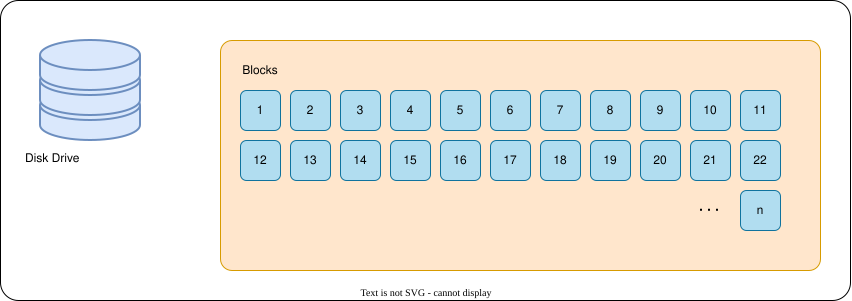
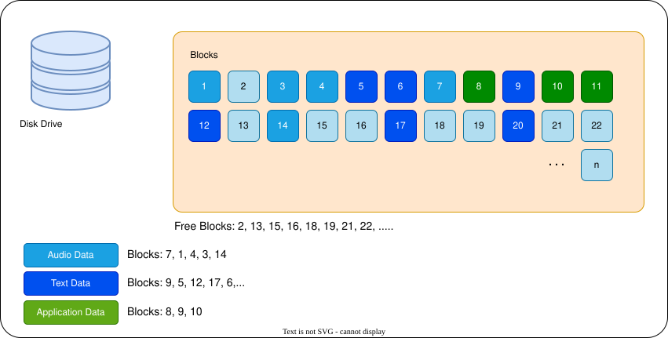
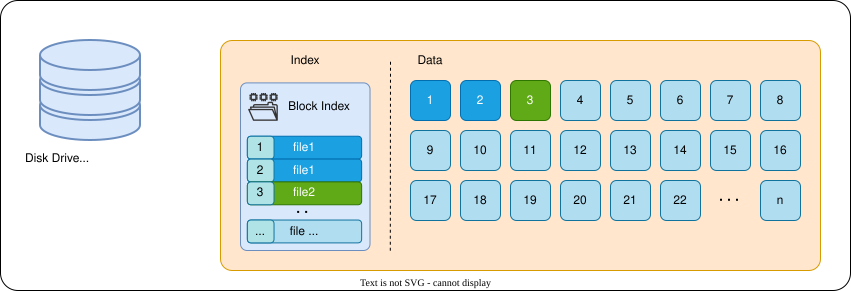
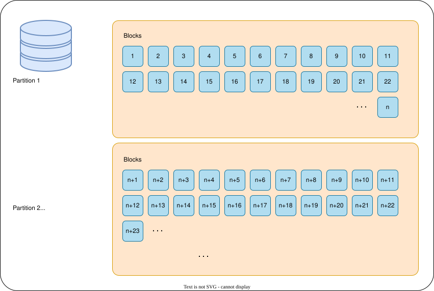
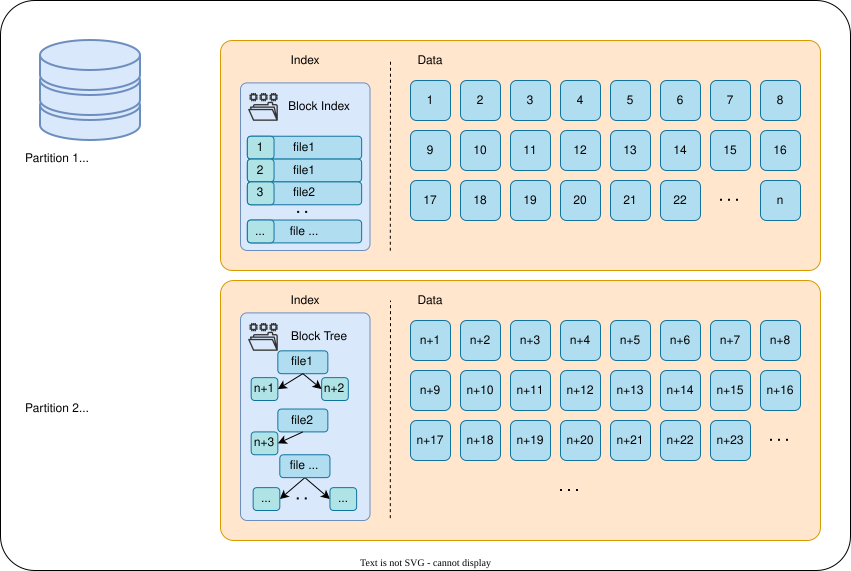
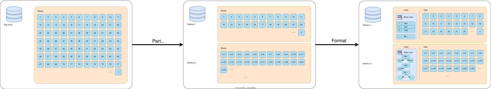

# What is a file system?

---

# Bibliography
for this section

1. **Brian Ward**, *How LINUX Works*, 3<sup>rd</sup> Edition, No Starch Press, 2021
    - Chapter 4 - *Disks and Filesystems*
      - Sections 4.1 and 4.2

---
---
# How disk drives work
they read and write blocks of data (512 B)



```rust {none|1|2|all}{lines: false}
fn read(block: usize) -> Result<[u8; 512], DiskError>; // read a block
fn write(block: usize, data: [u8; 512]) -> Result<(), DiskError> // write a block
```

<v-switch>

<template #-1>
Writes a block of data and returns nothing or an error.
</template>

<template #-2>
Reads a block and returns either 512 bytes of data or an error.
</template>

</v-switch>

---
---
# How do you store data?

<center>
    
</center>

The user or developer has to remeber a list of blocks in order.

---
---
# What is a file system?
organizes blocks into files and folders

<center>
    
</center>

Two parts:
- *metadata* - stores the blocks that contain the *list of blocks* about the files and folders
- *data* - stores the blocks with the actual data

---
---
# File System Types
each operating system has *its own filesystem*

<v-clicks>

| OS | Native File System(s) | 3rd Party |
|-|-|-|
| Windows | `NTFS`, `FAT` | - |
| macOS | `APFS`, `HPFS`, `NTFS`[^readonly], `FAT`, `macFUSE`[^userspace] | `NTFS` |
| Linux | `ext4`, `OpenZFS`, `btrfs`, `NFS`, `FAT`, `fuse`[^userspace] | `NTFS`, `APFS` |

</v-clicks>

<v-click>

⚠️ One file system per disk drive!

</v-click>

<v-click>

⁉️ What if we want more the one operating system on a disk drive?

</v-click>


[^readonly]: Read Only Support
[^userspace]: **F**ile **S**ystem in **Us**erspace - driver that allows writing of FS as normal applications

---
---
# Partitions
allow multiple file systems on the same disk drive

<div grid="~ cols-3 gap-5">

<div>

- there has to be **at least one** partition
- partitions do not have to be equal in size
- each parition allows **one file system**

<v-click>

Two partitioning systems
- Master Boot Record - `MBR`
  - legacy
  - ⚠️ 4 paritions / 2 TB
- **GUID Partition Table** - `GPT`

</v-click>

</div>

<div col="span-2">
    
</div>

</div>

---
---
# Formatting
initializing a file system (index) on a partition

<div grid="~ cols-3 gap-5">

<div>

- split the parition in two
  - *metadata*
  - *data*
- write the *file index* to the
- usually **does not delete any data** blocks

💡uses around 10% of disk space

</div>

<div col="span-2">
    
</div>

</div>

---
---
# File System Actions

<v-clicks depth="1">

1. **Partition** - split the drive space into non overlapping parts
2. **Format** - write the *file index* to one of the paritions
    - ⚠️ paritions have to be formatted to be used
    - 💡 loose around 10% of disk space
3. **Mount** - ask the operating system to display the parition
    - Windows: usually as a drive letter (C: D: ...)
    - POSIX: **replace a folder with the contents of the parition**

</v-clicks>

<br>

<div style="background-color: white; padding: 5px" class="rounded">

</div>
