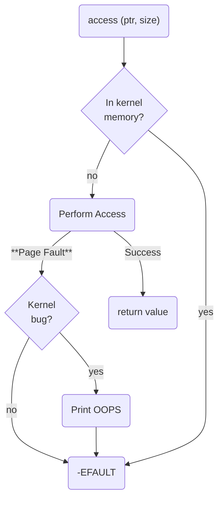

# System Call for Linux
*CISC-like* system calls

---
layout: two-cols
---
# Linux's System Call
for 32 bit x86 processors

<style>
  table {
    font-size: 0.5em;
    border-collapse: collapse;
  }
  th {
    font-weight: bold;
  }
  td, th {
    padding: 4px; /* Reduce padding */
  }
</style>

| Number | Syscall Name  | Description                         | Arguments (eax, ebx, ecx, edx, esi, edi) |
|---------------|--------------|-------------------------------------|-----------------------------------------|
| 1             | sys_exit      | Exit a process                     | (exit_code)                             |
| 2             | sys_fork      | Create a child process             | (none)                                  |
| 3             | sys_read      | Read from file descriptor          | (fd, buf, count)                        |
| 4             | sys_write     | Write to file descriptor           | (fd, buf, count)                        |
| 5             | sys_open      | Open a file                        | (filename, flags, mode)                 |
| 6             | sys_close     | Close a file descriptor            | (fd)                                    |
| 7             | sys_waitpid   | Wait for child process             | (pid, status, options)                  |
| 8             | sys_creat     | Create a file                      | (filename, mode)                        |
| 9             | sys_link      | Create a hard link                 | (oldpath, newpath)                      |
| 10            | sys_unlink    | Remove a file                      | (filename)                              |
| 11            | sys_execve    | Execute a program                  | (filename, argv, envp)                  |
| 12            | sys_chdir     | Change working directory           | (path)                                  |
| 13            | sys_time      | Get system time                    | (tloc)                                  |
| 14            | sys_mknod     | Create a special file              | (filename, mode, dev)                   |
| 15            | sys_chmod     | Change file permissions            | (filename, mode)                        |

:: right ::


| Number | Syscall Name  | Description                         | Arguments (eax, ebx, ecx, edx, esi, edi) |
|---------------|--------------|-------------------------------------|-----------------------------------------|
| 16            | sys_lchown    | Change owner of a file (symbolic)  | (filename, owner, group)                |
| 19            | sys_lseek     | Move file read/write pointer       | (fd, offset, whence)                    |
| 20            | sys_getpid    | Get process ID                     | (none)                                  |
| 29            | sys_pause     | Wait for signal                    | (none)                                  |
| 37            | sys_kill      | Send signal to a process           | (pid, signal)                           |
| 45            | sys_brk       | Change data segment size           | (addr)                                  |
| 54            | sys_ioctl     | Device-specific I/O operations     | (fd, request, argp)                     |
| 78            | sys_gettimeofday | Get current time               | (tv, tz)                                |
| 90            | sys_mmap      | Map memory                         | (addr, length, prot, flags, fd, offset) |
| 91            | sys_munmap    | Unmap memory                       | (addr, length)                          |
| 102           | sys_socketcall| Socket system calls wrapper        | (call, args)                            |
| 120           | sys_clone     | Create a new process (thread)      | (flags, child_stack, ptid, tls, ctid)   |
| 122           | sys_uname     | Get system information             | (buf)                                   |
| 140           | sys_llseek    | Large file seek                    | (fd, offset_high, offset_low, result, whence) |
| 162           | sys_nanosleep | Sleep for a given time             | (rqtp, rmtp)                            |
| 168           | sys_poll      | Wait for I/O events                | (fds, nfds, timeout)                    |
| 183           | sys_getcwd    | Get current working directory      | (buf, size)                             |
| 252           | sys_exit_group| Exit all threads in process        | (exit_code)                             |

---
layout: two-cols
---
# Linux's System Calls
for 64 bit x86 processors

<style>
  table {
    font-size: 0.5em;
    border-collapse: collapse;
  }
  th {
    font-weight: bold;
  }
  td, th {
    padding: 4px; /* Reduce padding */
  }
</style>

| Syscall Number | Syscall Name        | Description                             | Arguments (rax, rdi, rsi, rdx, r10, r8, r9)   |
|-----------------|---------------------|-----------------------------------------|------------------------------------------------|
| 60              | sys_exit            | Exit a process                         | (exit_code)                                    |
| 39              | sys_fork            | Create a child process                 | (none)                                         |
| 0               | sys_read            | Read from file descriptor              | (fd, buf, count)                               |
| 1               | sys_write           | Write to file descriptor               | (fd, buf, count)                               |
| 2               | sys_open            | Open a file                            | (filename, flags, mode)                        |
| 3               | sys_close           | Close a file descriptor                | (fd)                                           |
| 9               | sys_mmap            | Memory mapping                         | (addr, length, prot, flags, fd, offset)        |
| 11              | sys_execve          | Execute a program                      | (filename, argv, envp)                         |
| 16              | sys_lseek           | Change file offset                     | (fd, offset, whence)                           |
| 20              | sys_getpid          | Get process ID                         | (none)                                         |
| 23              | sys_getppid         | Get parent process ID                  | (none)                                         |
| 26              | sys_kill            | Send a signal to a process             | (pid, signal)                                  |
| 33              | sys_nanosleep       | Sleep for a given time                 | (rqtp, rmtp)                                   |
| 41              | sys_socket          | Create a socket                        | (domain, type, protocol)                       |
| 42              | sys_connect         | Connect a socket to a remote address   | (fd, addr, addrlen)                            |
| 57              | sys_clone           | Create a new process (thread)          | (flags, child_stack, ptid, tls, ctid)          |

:: right ::

| Syscall Number | Syscall Name        | Description                             | Arguments (rax, rdi, rsi, rdx, r10, r8, r9)   |
|-----------------|---------------------|-----------------------------------------|------------------------------------------------|
| 59              | sys_wait4           | Wait for process to change state       | (pid, status, options, rusage)                 |
| 72              | sys_fstatat         | Get file status                        | (dirfd, pathname, statbuf, flags)              |
| 87              | sys_munmap          | Unmap memory                           | (addr, length)                                 |
| 93              | sys_ioctl           | Device-specific I/O operations         | (fd, request, argp)                            |
| 104             | sys_set_tid_address | Set thread ID address                  | (tid)                                          |
| 115             | sys_fadvise64       | Advise on file I/O operations          | (fd, offset, len, advice)                      |
| 156             | sys_prlimit64       | Get or set resource limits             | (pid, resource, new_limit, old_limit)          |
| 183             | sys_getcwd          | Get current working directory          | (buf, size)                                    |
| 231             | sys_uname           | Get system information                 | (buf)                                          |
| 263             | sys_exit_group      | Exit all threads in the process group  | (exit_code)                                    |

---
---
# Making a system call
for 32 bit x86 processors

- put the arguments in registers
- switch to *supervisor mode*
  - make a <span v-mark.underline.orange>*trap*</span> - `int 80h` (Linux) / `int 20h` (Windows)
  - call a specific instruction like <span v-mark.underline.green>`sysenter` (Intel)</span> or <span v-mark.underline.green>`syscall` (AMD)</span>

```asm
mov eax, syscall_number
mov ebx, arg1
mov ecx, arg2
mov edx, arg3
mov esi, arg4
mov edi, arg5
; trap
int 0x80 
```

- the single return value is placed in `eax`

---
layout: two-cols
---
# System Call Dispatcher

```c {*}{lines: false}
#define __SYSCALL_I386(nr, sym, qual) [nr] = sym,

const sys_call_ptr_t ia32_sys_call_table[] = {
  [0 ... __NR_syscall_compat_max] = &sys_ni_syscall,
  #include <asm/syscalls_32.h>
};

__SYSCALL_I386(0, sys_restart_syscall)
__SYSCALL_I386(1, sys_exit)
__SYSCALL_I386(2, sys_fork)
__SYSCALL_I386(3, sys_read)
__SYSCALL_I386(4, sys_write)
#ifdef CONFIG_X86_32
__SYSCALL_I386(5, sys_open)
#else
__SYSCALL_I386(5, compat_sys_open)
#endif
__SYSCALL_I386(6, sys_close)
```

::right::

```c {*}{lines: false}
/* Handles int $0x80 */
void do_int80_syscall_32(struct pt_regs *regs)
{
    enter_from_user_mode();
    local_irq_enable();
    do_syscall_32_irqs_on(regs);
}

/* simplified version of the Linux x86 32bit System Call 
   Dispatcher */
static void do_syscall_32_irqs_on(struct pt_regs *regs)
{
    unsigned int nr = regs->orig_ax;

    if (nr < IA32_NR_syscalls)
        regs->ax = ia32_sys_call_table[nr]
            (regs->bx, regs->cx,
             regs->dx, regs->si,
             regs->di, regs->bp);
    syscall_return_slowpath(regs);
}
```

---
layout: two-cols
---
# Accessing memory from userspace
pointers from userspace have to be validated

<style>
.two-columns {
    grid-template-columns: 8fr 3fr;
}
</style>

1. Is the address in the kernel's memory? - `if`
2. Is the address in the process' address space?
    - difficult with `if` - <span v-mark.underline.red>takes time</span>
    - use <span v-mark.underline.green>MMU faults</span>
3. Access the memory
   - works -> return the value
   - faults -> <span v-mark.circle.orange>figure out why</span>?

**Possible Faults**
1. copy-on-write, demand paging or reserved but not committed page
2. faulty address
3. kernel bug

::right::



---
layout: two-cols
---
# Memory Access API

- The kernel API provides special userspace memory access *functions* / *macros*
- Drivers and kernel code **have to** access userspace memory only through these

```c {*}{lines: false}
/* OK: return -EFAULT if user_ptr is invalid */
if (copy_from_user(&kernel_buffer, user_ptr, size))
    return -EFAULT;

/* Not OK: only works if user_ptr is valid 
   otherwise crashes kernel */
memcpy(&kernel_buffer, user_ptr, size);
```

```c {*}{lines: false}
// Is the address in the kernel's memory?
int access_ok(const void * addr, unsigned long size) {
  unsigned long a = (unsigned long) addr;
  if (a + size < a ||
    a + size > current_thread_info()->addr_limit.seg)
    return 0;
  return 1;
}
```

::right::

<style>
  table {
    font-size: 1em;
    border-collapse: collapse;
  }
  th {
    font-weight: bold;
  }
  td, th {
    padding: 4px; /* Reduce padding */
  }
</style>


| **Function / Macro**       | **Description**                                                                 |
|----------------------------|---------------------------------------------------------------------------------|
| `get_user()`               | Safely retrieves a single value from user-space memory and copies it into kernel-space. |
| `put_user()`               | Safely stores a single value from kernel-space into user-space memory.            |
| `copy_from_user()`         | Copies a block of memory from user-space to kernel-space.                        |
| `copy_to_user()`           | Copies a block of memory from kernel-space to user-space.                        |
| `access_ok()`              | Checks if the user-space address is valid and accessible.                        |
| `clear_user()`             | Clears a region of memory in user-space (sets bytes to zero).                   |

---
layout: two-cols
---
# Fault cause?
Is it a wrong address or a kernel bug?

The `get_user` functions

```asm {*}{lines: false}
__get_user_1:       ; get 1 byte
    1: movzx   edx, byte ptr [eax]   
    ...
__get_user_2:       ; get 2 bytes
    2: movzx   edx, word ptr [eax - 1] 
    ...
__get_user_4:       ; get 4 bytes
    3: mov     edx, dword ptr [eax - 3]  
    ...
bad_get_user:
    xor     edx, edx
    mov     eax, -EFAULT
    ret

.section __ex_table, "a"    ; Exception table
    .long   1b, bad_get_user, ex_handler_default       
    .long   2b, bad_get_user, ex_handler_default       
    .long   3b, bad_get_user, ex_handler_default       
.previous
```

::right::

Simulates a the behaviour of the `cmp` instruction

```c {*}{lines: false}
// Called by the page fault handler
int fixup_exception(struct pt_regs *regs, int trapnr)
{
    const struct exception_table_entry *e;
    ex_handler_t handler;

    e = search_exception_tables(regs->ip);
    if (!e)
        // no handler, this is a kernel bug
        return 0;

    handler = ex_fixup_handler(e);
    return handler(e, regs, trapnr);
}

bool ex_handler_default(const struct exception_table_entry *fixup,
                        struct pt_regs *regs, int trapnr)
{
    // jump to the `if-fault address`
    regs->ip = ex_fixup_addr(fixup);
    return true;
}
```

---
---
# System call instruction?
`int80h`, `sysenter` or `syscall`

- depends on the processor version
- `sysenter` and `syscall` are faster but not always available
- the kernel and the `libc` must use the same instruction

`vsyscall` vDSO object
- `ysenter_setup()` generates an ELF shared object that exports `vsyscall` that performs the system call
- libc calls `vsyscall` instead of an actual instruction

<div grid="~ cols-2 m-4">

<div>

without `sysenter` - up to Pentium
```asm
__kernel_vsyscall: 
    int 80h
    ret
```

</div>

<div>

with `syseneter` - starting with Pentium II
```asm
__kernel_vsyscall:
    push    ecx
    push    edx
    push    ebp
    mov     ebp, esp
    sysenter
```
</div>

</div>