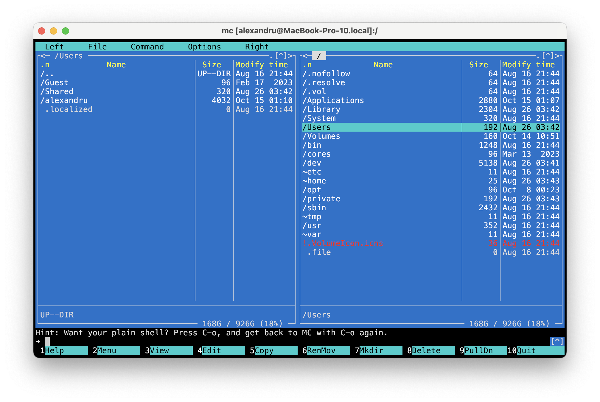
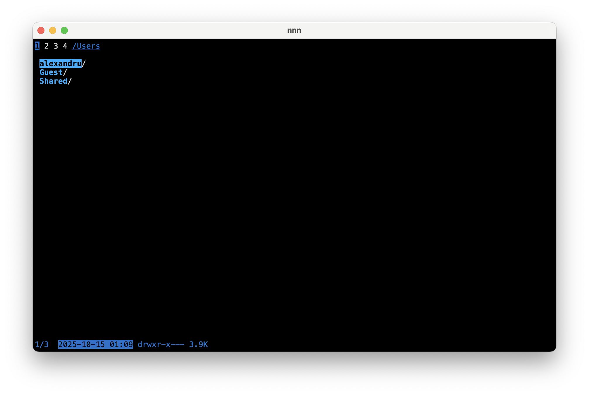
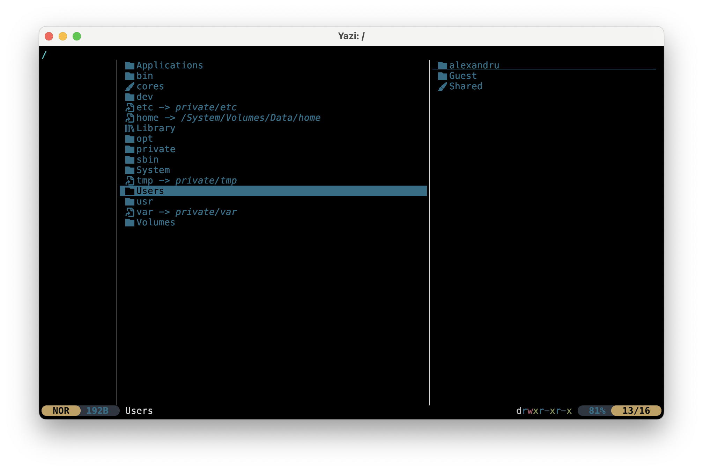
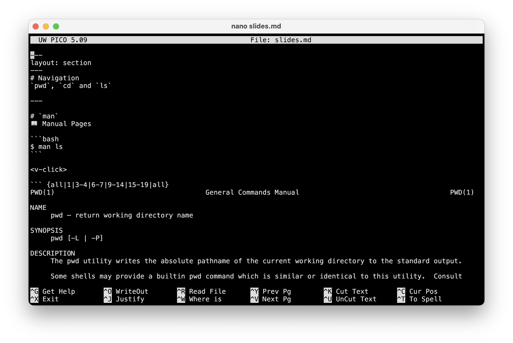
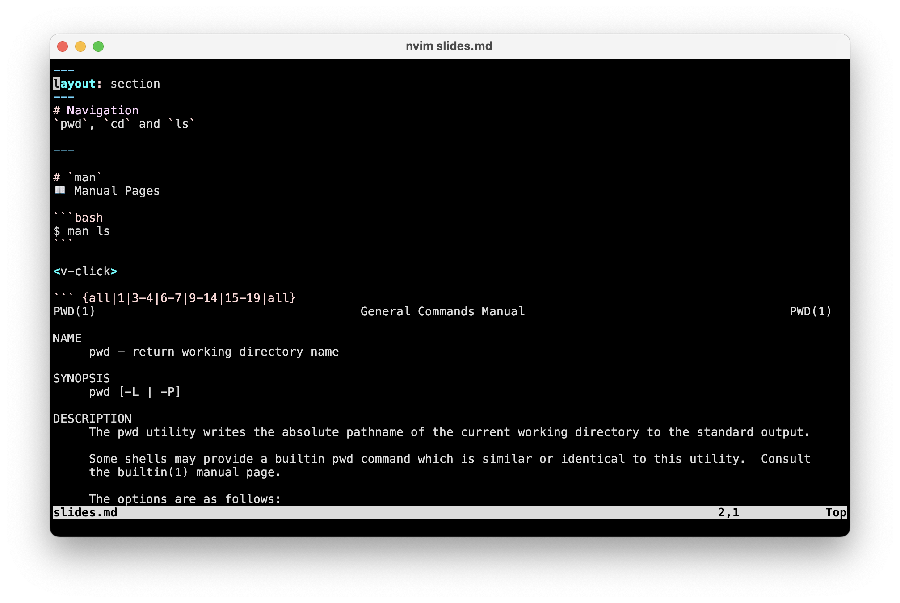
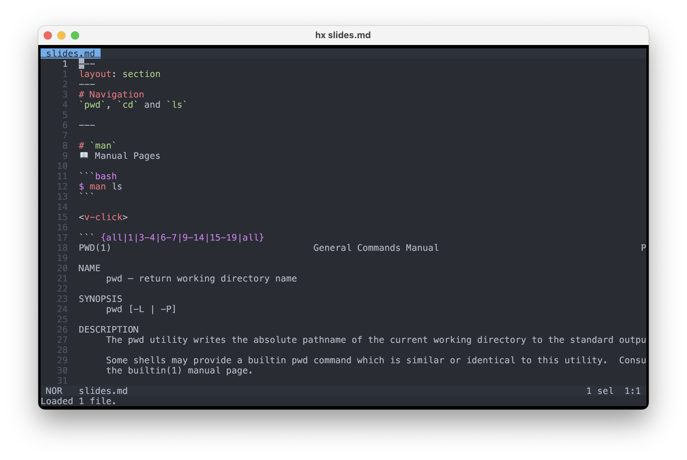

# Navigation
`pwd`, `cd` and `ls`

---

# Bibliography
for this section

1. **Brian Ward**, *How LINUX Works*, 3<sup>rd</sup> Edition, No Starch Press, 2021
    - Chapter 2 - *Basic Commands and Directory Hierarchy*
      - Section 2.4
2. **Razvan Deaconescu, Razbvan Rughinis, Mihai Carabas, Alexandru Radovici**, *Utilizarea Sistemelor de Operare*, Printech 2021, [download](https://github.com/systems-cs-pub-ro/carte-uso/releases/download/uso-ed1-2021/uso.pdf)
    - Chapter 2 - *Utilizarea sistemului de fișiere*
      - Sections 2.1

---

# `man`
📖 Manual Pages

```bash
$ man pwd
```

<v-click>

``` {all|1|3-4|6-7|9-14|15-19|all}
PWD(1)                                     General Commands Manual                                     PWD(1)

NAME
     pwd – return working directory name

SYNOPSIS
     pwd [-L | -P]

DESCRIPTION
     The pwd utility writes the absolute pathname of the current working directory to the standard output.

     Some shells may provide a builtin pwd command which is similar or identical to this utility.  Consult
     the builtin(1) manual page.

     The options are as follows:

     -L      Display the logical current working directory.

     -P      Display the physical current working directory (all symbolic links resolved).
...
```
</v-click>

---
layout: section
---
# ⚠️ read the manual
always read the manual **before using AI and searching online** for commands that you want to use

---
---
# `pwd`
📍 Print Working Directory

- Shows your **current directory** in the filesystem

### Syntax

```bash
pwd
```

### Example

```bash
$ pwd
/home/alice/Documents
```

---

# `cd`
📁 Change (Current) Directory

### Syntax

```bash
cd [directory]
```

> `[directory]` means that the `directory` parameter is optional

<br>

### Examples

```bash
$ cd /home/alice/Downloads   # absolute path
$ cd ../Documents            # relative path (up one level then into Documents)
$ cd ~                       # go to home directory
$ cd                         # go to home directory (no directory parameter)
```

---

# `ls`
📂 Listing Files and Directories

### Syntax

```bash
ls [options] [directory]
```

### Example

```rust
$ ls
Documents  Downloads  Pictures
$ ls -l
drwxr-xr-x  2 alice alice 4096 Oct 15 09:00 Documents
-rw-r--r--  1 alice alice  123 Oct 14 20:30 notes.txt
```

- `-l` → long listing
- `-a` → include hidden files (*. files*)
- `-h` → human-readable sizes (with `-l`)

---
layout: section
---
# File Management
`mkdir`, `cp`, `mv`, `rmdir` and `rm`

---

# Bibliography
for this section

1. **Brian Ward**, *How LINUX Works*, 3<sup>rd</sup> Edition, No Starch Press, 2021
    - Chapter 2 - *Basic Commands and Directory Hierarchy*
      - Section 2.3
2. **Razvan Deaconescu, Razbvan Rughinis, Mihai Carabas, Alexandru Radovici**, *Utilizarea Sistemelor de Operare*, Printech 2021, [download](https://github.com/systems-cs-pub-ro/carte-uso/releases/download/uso-ed1-2021/uso.pdf)
    - Chapter 2 - *Utilizarea sistemului de fișiere*
      - Sections 2.3

---
---
#  `cp`
📋 Copy Files and Directories

The `cp` command is used to **copy files and directories**.

### Syntax

```bash
cp [options] source destination
```

### Example

```bash {none|1|2|all}
$ cp file1.txt /home/alice/documents/ # copy a file
$ cp -r myfolder/ /home/alice/backup/ # copy a folder recursively
```

---
---
#  `mv`
📦 Move or Rename Files

The `mv` command is used to **move files or directories** or **rename them**.

### Syntax

```bash
mv [options] source destination
```

### Example

```bash {none|1|2|3|4|all}
$ mv oldname.txt newname.txt # rename a file or a folder
$ mv file.txt /home/alice/documents/ # move a file to a folder
$ mv file1.txt file2.txt /home/alice/backup/ # move multiple files to a folder
$ mv mv oldfolder/ newfolder/ # rename a folder
```

---
---
# `mkdir`
📁 Create Directories

The `mkdir` command is used to **create new directories**.

### Syntax

```bash
mkdir [options] directory_name
```

### Examples

```bash {none|1|2|all}
$ mkdir project # make a folder
$ mkdir -p projects/2025/october # make a folder and subfolders
```

---

# `rm` and `rmdir`
🗑️ Remove Files and Directories

<div grid="~ cols-2 gap-5">

<div>

### `rm` – Remove Files
Deletes files or directories (⚠️**destructive**!).

### Syntax

```bash
rm [options] file_name
```

### Example

```bash {none|1|2|3|all}
$ rm file.txt
$ rm file1.txt file2.txt
$ rm -r myfolder/
```

</div>

<div>

### `rmdir` – Remove Empty Directories

Deletes only **empty directories**.

### Syntax

```bash
rmdir [options] directory_name
```

### Example

```bash {none|1}
$ rmdir emptyfolder
```

</div>

</div>

💡 **Tip:**
- Use `rm -r` for non-empty directories.
- Always double-check files before using `rm` — ⚠️ it is permanent!

---
---

# File Management Software

- [Midnight Commander](https://midnight-commander.org) (`mc`)
- [n<sup>3</sup>](https://github.com/jarun/nnn) - *The unorthodox terminal file manager* (`nnn`)
- [Yazi](https://yazi-rs.github.io) - *⚡️ Blazing fast terminal file manager written in Rust, based on async I/O.* (`yazi`)

<br>
<br>
<br>

<div grid="~ cols-3 gap-5">





</div>

---
---
# File Editors
✏️ for text files

- the operating systems does not support *editing files*
- each file type has several applications that can edit it
- POSIX provides text file editors

<br>

<div grid="~ cols-3 gap-5">

<div align="center">

*Very Basic*

`pico` / [`nano`](https://www.nano-editor.org)

</div>


<div align="center">

*What professionals use*

`vi` / [`vim`](https://www.vim.org) / [`nvim`](https://neovim.io)

</div>

<div align="center">

*New runner up*

[`helix`](https://helix-editor.com)

</div>

</div>
