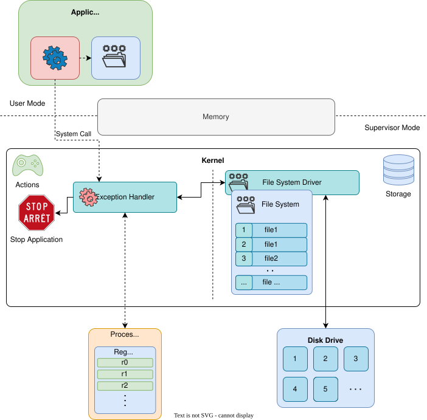
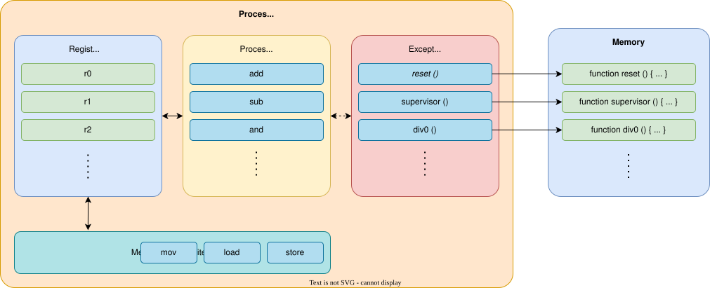

# Operating System
the main role

**Allow Portability**
- provides a hardware independent API
- applications should run on any hardware

**Resources Management and Isolation**
- allow applications to access resources
- prevent applications from accessing hardware directly
- isolate applications

:: right ::

---
layout: two-cols
---
# System Call
the OS API

**accessing hardware** can be **performed** only **by the kernel**

The application:

<v-clicks>

1. puts values in the registers / stack
2. triggers an exception 
   - `svc` instruction for ARM 
   - `sysenter` instruction for x86

</v-clicks>

The kernel:

<v-clicks>

1. looks at the registers and determines what the required action is
2. performs the action
3. puts the return values in registers / stack

</v-clicks>

:: right ::

<v-click at="-3">

</v-click>
