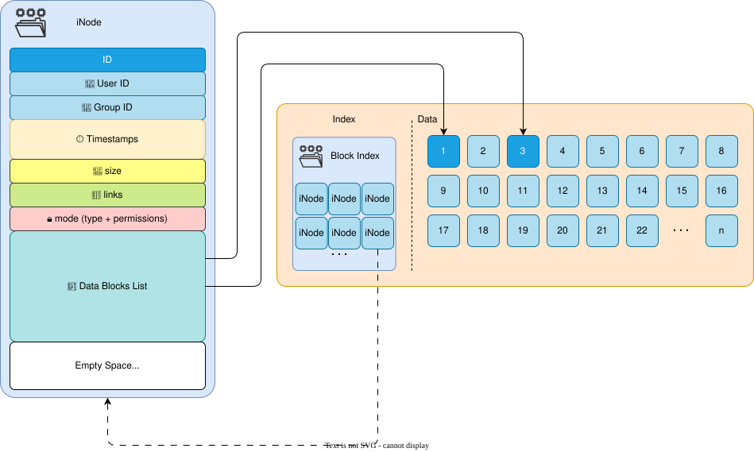
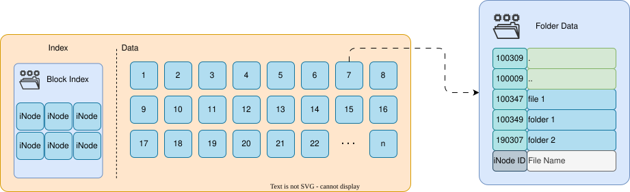
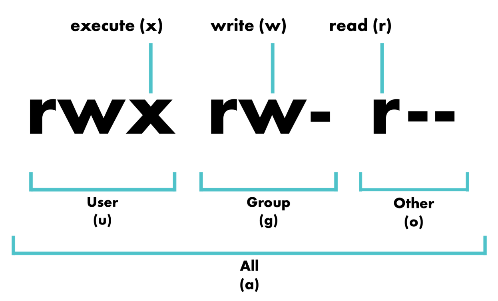

# File Types and Permissions

---

# Bibliography
for this section

1. **Brian Ward**, *How LINUX Works*, 3<sup>rd</sup> Edition, No Starch Press, 2021
    - Chapter 2 - *Basic Commands and Directory Hierarchy*
      - Section 2.17
2. **Razvan Deaconescu, Razbvan Rughinis, Mihai Carabas, Alexandru Radovici**, *Utilizarea Sistemelor de Operare*, Printech 2021, [download](https://github.com/systems-cs-pub-ro/carte-uso/releases/download/uso-ed1-2021/uso.pdf)
    - Chapter 5 - *Utilizatori*
      - Sections 5.5

---
class: text-sm
---
# 🗂️ File Types in Linux

Linux treats everything as a **file**, but there are several types:

| Symbol | Type | Description | Example |
|:-------|:------|:-------------|:----------|
| `-` | 📄 **Regular file** | Text, binary, images, executables | `/etc/passwd`, `/bin/ls` |
| `d` | 📁 **Directory** | Contains other files or directories | `/home`, `/usr/bin` |
| `l` | 🔗 **Symbolic link** | Shortcut or reference to another file | `/lib64 → /usr/lib64` |
| `c` | ⚙️ **Character device** | Device file that handles data character by character | `/dev/tty`, `/dev/null` |
| `b` | 💾 **Block device** | Device file that handles data in blocks | `/dev/sda`, `/dev/loop0` |
| `p` | 🚇 **Named pipe (FIFO)** | Used for inter-process communication | Custom IPC files |
| `s` | 🌐 **Socket** | Used for network or inter-process communication | `/run/docker.sock` |

---
---
# iNode
file information node

<v-switch>

<template #0>

<center>

</center>

</template>

<template #1>

<center>

## 🤔💭 What is missing?

<br>


</center>

</template>

</v-switch>

---
---
# Folder Data
where the file name is stored

- ***links** iNodes to file names*
- `.` and `..` are always present
- the folder is a *file who's contents is read by the file system driver*

<center>

</center>

---
---
# How Symbolic and Hard Links Work

<div grid="~ cols-2 gap-5">

<div>

### 🔗 Symbolic Link

```bash {*}{lines: false}
ln -s link.txt original.txt
```

```bash {*}{lines: false}
$ ls -l -i
154736548 lrwxr-xr-x   1 ...  link.txt -> original.txt
154736507 -rw-r--r--   1 ...  original.txt
```

``` {*}{lines: false}
📂 /home/user/
├── 📄 original.txt
└── 🔗 link.txt  ➜  points to /home/user/original.txt
```

- `link.txt` stores the **path** to the target.
- If `original.txt` is deleted ❌ → the link breaks.

</div>

<div>

### ⚓ Hard Link

```bash {*}{lines: false}
ln link.txt original.txt
```

```bash {*}{lines: false}
$ ls -l -i
154736507 -rw-r--r--   2 ... link.txt
154736507 -rw-r--r--   2 ... original.txt
```

``` {*}{lines: false}
📂 /home/user/
├── 📄 original.txt  (inode #1234)
└── 📄 link.txt      (inode #1234)
```

- Both files share the **same inode number**.
- If `original.txt` is deleted 🗑️ → `link.txt` still accesses the same data.
- The data is only deleted when **all hard links** are removed.

</div>

</div>

---
---
# Read, Write, Execute

Each file or directory has three types of permissions:

| Symbol | 🔢 Octal | Meaning | 🧾 For Files | 📁 For Folders |
|:------|:-----:|:--------|:-------------------------------|:--------------------------------|
| `r`   | 4     | 📖 Read | View file contents | List files inside the folder |
| `w`   | 2     | ✏️ Write | Modify or delete the file | Create, delete or rename files inside |
| `x`   | 1     | ⚙️ Execute | Run the file (if executable) | Enter the folder (`cd`) and access contents |

Example

```bash {none|1|2|3|all}
$ ls -l
drwxr-xr-x  2 alice alice 4096 Oct 15 09:00 Documents
-rw-r--r--  1 alice alice  123 Oct 14 20:30 notes.txt
```

---

# Read, Write, Execute for ...
to whom do these apply

<div grid="~ cols-2 gap-5">

<div>

| Group | Applies To |
|:------|:------------|
| **u** | 👤 User (owner) |
| **g** | 👥 Group |
| **o** | 🌍 Others (everyone else) |

</div>



</div>

### Rules

<v-clicks>

- each 📄 file has an 👤 owner
- each 📄 file belongs to a 👥 group
- there are **other** users that are not the owner of the file and do not belong to the file's group

</v-clicks>
