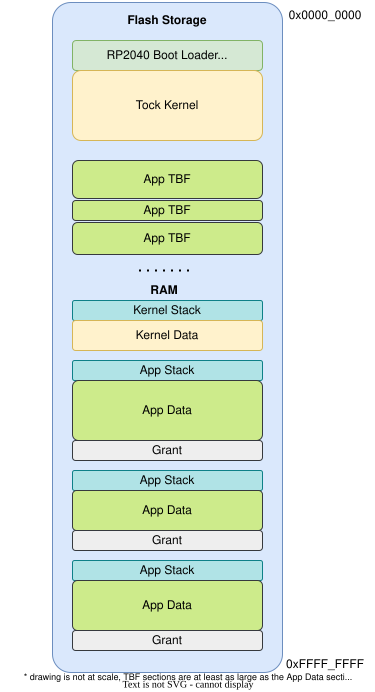
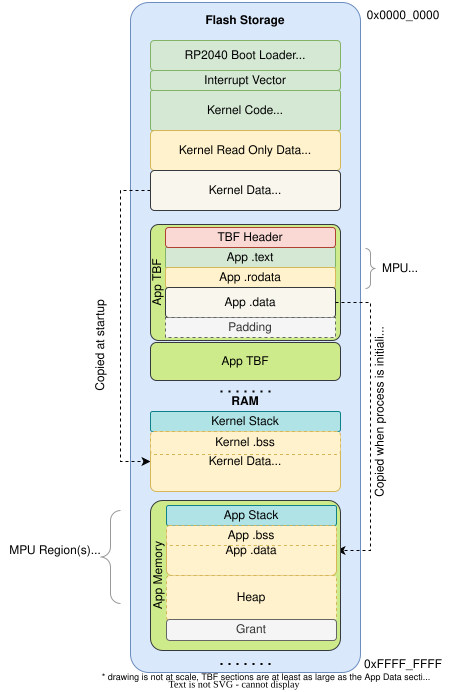
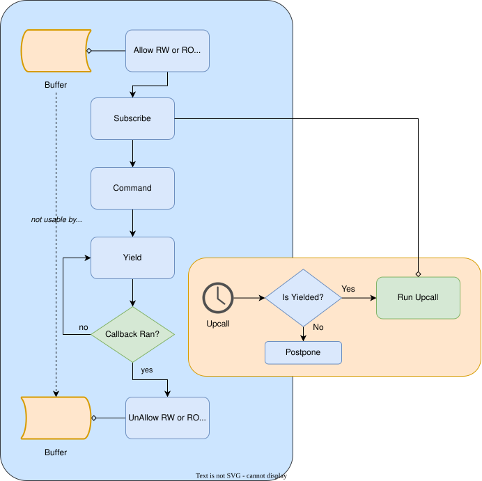
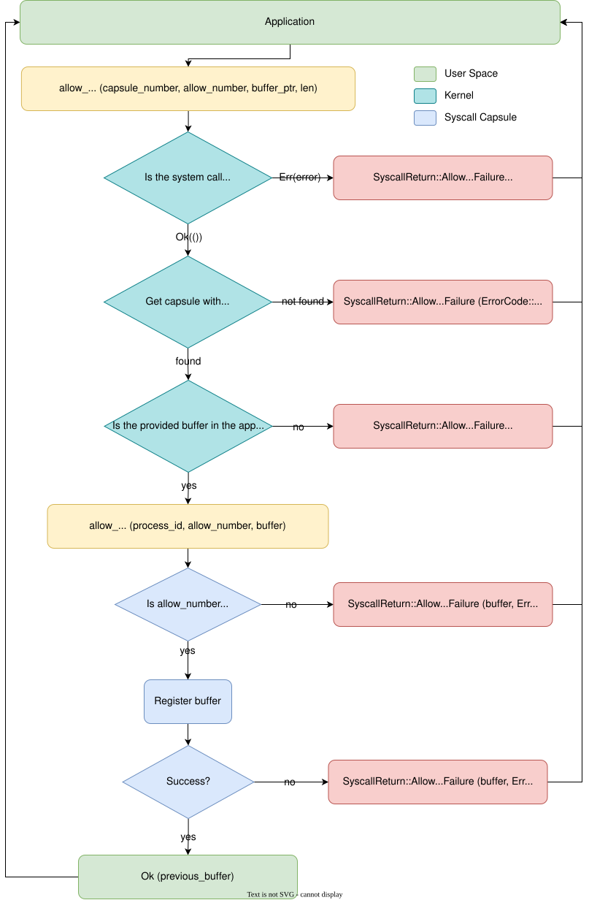
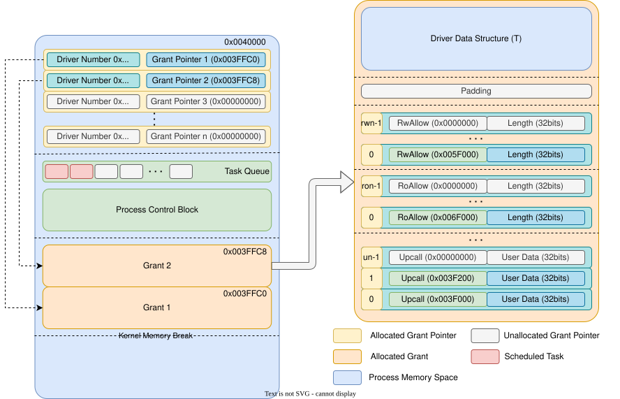

# System Call for Tock OS
*RISC-style* system calls

---
layout: two-cols
---
# Memory Layout
for the RP2040

<style>
.two-columns {
    grid-template-columns: 5fr 3fr;
}
</style>

**Kernel**
- is written in flash separated from the apps
- loads each app at boot

**Applications**
- each application TBF is written to the flash separately
- each application has a separate
  - *stack* in RAM
  - *grant* section where the kernel stores data about the app
  - *data* section in RAM


:: right ::



---
layout: two-cols
---
# Memory Layout
for the RP2040 at runtime

<style>
.two-columns {
    grid-template-columns: 5fr 3fr;
}
</style>

**Kernel**
- sets up the MPU every time it switches to a process

**Applications**
- can read and execute its code
- can read and write its *stack* and *data*
- can read and write the *allocated heap*

Applications are **not allowed** to access the **kernel's memory** or **the peripherals**.


:: right ::



---
layout: two-cols
---
# System Calls

0. Yield
1. Subscribe
2. Command
3. ReadWriteAllow
4. ReadOnlyAllow
5. Memop
6. Exit
7. UserspaceReadableAllow

:: right ::



---
---

# 5: Memop

Memop expands the memory segment available to the process, allows the process to
retrieve pointers to its allocated memory space, provides a mechanism for
the process to tell the kernel where its stack and heap start, and other
operations involving process memory.

```rust {*}{lines: false}
memop(op_type: u32, argument: u32) -> [[ VARIES ]] as u32
```

<div grid="~ cols-2 gap-3">

<div>

**Arguments**

 - `op_type`: An integer indicating whether this is a `brk` (0), a `sbrk` (1),
   or another memop call.
 - `argument`: The argument to `brk`, `sbrk`, or other call.

Each memop operation is specific and details of each call can be found in
the [memop syscall documentation](https://github.com./tock/blob/master/doc/syscalls/memop.md).

</div>

<div>

**Return**

- Dependent on the particular *memop* call.

</div>
</div>

---
---
# 6: Exit

The process signals the kernel that it has no more work to do and can be stopped or that it asks
the kernel to restart it.

```rust {*}{lines: false}
tock_exit(completion_code: u32)
tock_restart(completion_code: u32)
```

**Return**

None

---
---

# 2: Command

Command instructs the driver to perform a specific action.

```rust {*}{lines: false}
command(driver: u32, command_number: u32, argument1: u32, argument2: u32) -> CommandReturn
```

<div grid="~ cols-2 gap-3">

<div>

**Arguments**

 - `driver`: integer specifying which driver to use
 - `command_number`: the requested command.
 - `argument1`: a command-specific argument
 - `argument2`: a command-specific argument

One Tock convention with the *Command* system call is that command number 0 will
always return a value of 0 or greater if the driver is present.

</div>

<div>

**Return**
- three `u32` numbers
- Errors
   - `NODEVICE` if `driver` does not refer to a valid kernel driver.
   - `NOSUPPORT` if the driver exists but doesn't support the `command_number`.
   - Other return codes based on the specific driver.

</div>
</div>

---
---

# 1: Subscribe

Subscribe assigns upcall functions to be executed in response to various
events.

```rust {*}{lines: false}
subscribe(driver: u32, subscribe_number: u32, upcall: u32, userdata: u32) -> Result<Upcall, (Upcall, ErrorCode)>
```

<div grid="~ cols-2 gap-3">

<div>

**Arguments**

 - `driver`: integer specifying which driver to use
 - `subscribe_number`: event number
 - `upcall`: function's pointer to call upon event
```c {lines: false}
void upcall(int arg1, int arg2, int arg3, void* userdata)
```
 - `userdata`: value that will be passed back, usually a pointer

</div>

<div>

**Return**

- The previously registered upcall or `TOCK_NULL_UPCALL`
- Errors
   - `NODEVICE` if `driver` does not refer to a valid kernel driver.
   - `NOSUPPORT` if the driver exists but doesn't support the `subscribe_number`.

</div>
</div>

---
---

# 0: Yield

Yield transitions the current process from the Running to the Yielded state.

```rust
// waits for the next upcall
// The process will not execute again until another upcall re-schedules the process.
yield()

// does not wait for the next upcall
// If a process has no enqueued upcalls, the process immediately re-enters the Running state.
yield_no_wait()

// waits for a specific upcall
// The process will not execute again until the desired upcall re-schedules the process.
yield_for(driver_number: u32, subscribe_number: u32);
```

## Return

*yield*: None

*yield_no_wait*: `0` - there was no queued *upcall* function to execute / `1` - *upcall* ran

*yield_for*: None

---
---

# 3 and 4: AllowRead(Write/Only)

Allow shares memory buffers between the kernel and application.

```rust {*}{lines: false}
allow_readwrite(driver: u32, allow_number: u32, pointer: usize, size: u32) -> Result<ReadWriteAppSlice, (ReadWriteAppSlice, ErrorCode)>
allow_readonly(driver: u32, allow_number: u32, pointer: usize, size: u32) -> Result<ReadWriteAppSlice, (ReadWriteAppSlice, ErrorCode)>
```

<div grid="~ cols-2 gap-3">

<div>

**Arguments**

 - `driver`: integer specifying which driver to use
 - `allow_number`: driver-specific integer specifying the purpose of this
   buffer
 - `pointer`: pointer to the buffer in the process memory space
   - null pointer revokes a previously shared buffer
 - `size`: the length of the buffer

</div>

<div>

**Return**
- The previous allowed buffer or NULL
- Errors
   - `NODEVICE` if `driver` does not refer to a valid kernel driver.
   - `NOSUPPORT` if the driver exists but doesn't support the `allow_number`.
   - `INVAL` the buffer referred to by `pointer` and `size` lies completely or
partially outside of the processes addressable RAM.

</div>
</div>

---
layout: two-cols
---
# System Call Pattern

<v-clicks>

1. *allow*: if data exchange is required, share a buffer with a driver
2. *subscribe* to the *action done* event
3. send a *command* to ask the driver to start performing an action
4. *yield* to wait for the *action done* event
   - *the kernel calls a callback*
   - verify if the expected event was triggered, if not *yield*
5. *unallow*: get the buffer back from the driver

</v-clicks>

:: right ::


---
---
# Making a system call
ARM Cortex-M

```c
syscall_return_t command(uint32_t driver, uint32_t command,
                         int arg1, int arg2) {
  register uint32_t r0 __asm__ ("r0") = driver;
  register uint32_t r1 __asm__ ("r1") = command;
  register uint32_t r2 __asm__ ("r2") = arg1;
  register uint32_t r3 __asm__ ("r3") = arg2;
  register uint32_t rtype __asm__ ("r0");
  register uint32_t rv1 __asm__ ("r1");
  register uint32_t rv2 __asm__ ("r2");
  register uint32_t rv3 __asm__ ("r3");
  __asm__ volatile (
    "svc 2"
    : "=r" (rtype), "=r" (rv1), "=r" (rv2), "=r" (rv3)
    : "r" (r0), "r" (r1), "r" (r2), "r" (r3)
    : "memory"
    );
  syscall_return_t rval = {rtype, {rv1, rv2, rv3}};
  return rval;
}
```

---
---
# Making a system call
x86

```asm
push    0           # arg 4: unused
push    0           # arg 3: unused
push    0           # arg 2: unused
push    1           # arg 1: yield-wait
mov     eax, 0      # class: yield
int     0x40
add     esp, 16     # clean up stack
```

- performs a trap `int 04h`
- parameters are sent on the stack

> *In contrast with other embedded architectures like ARM or RISC-V, x86 does _not_ have very many general purpose registers to spare. The ABI defined here draws heavily from the `cdecl` calling convention by using the stack instead of registers to pass data between user and kernel mode.*

---
---
# System call dispatcher

```rust
match syscall {
  Syscall::Memop { operand, arg0 } => { /* ... */ }
  Syscall::Yield { which, param_a, param_b } => { /* ... */ }
  Syscall::Subscribe { driver_number, .. }
  | Syscall::Command { driver_number, .. }
  | Syscall::ReadWriteAllow { driver_number, .. }
  | Syscall::UserspaceReadableAllow { driver_number, .. }
  | Syscall::ReadOnlyAllow { driver_number, .. } => {
      resources
      .syscall_driver_lookup()
      .with_driver(driver_number, |driver| match syscall {
        Syscall::Subscribe {driver_number, subdriver_number, upcall_ptr, appdata} => { /* d.subscribe (...) */ }
        Syscall::Command {driver_number, subdriver_number, arg0, arg1} => { /* d.command(...) */ }
        Syscall::ReadWriteAllow {driver_number, subdriver_number, allow_address allow_size} => { /* d.read_write_allow(...) */ }
        Syscall::UserspaceReadableAllow {driver_number, subdriver_number, allow_address, allow_size} => { /* d.userspace_readable_allow(...) */ }
        Syscall::ReadOnlyAllow {driver_number, subdriver_number, allow_address, allow_size} => { /* d.read_only_allow(...) */ }
        Syscall::Yield { .. }
        | Syscall::Exit { .. }
        | Syscall::Memop { .. } => { debug_assert!(false, "Kernel system call handling invariant violated!"); },
      })
  }
  Syscall::Exit { which, completion_code } => { /* stop or restart process */ }
}
```

---
layout: two-cols
---
# Address Verification

- memory is shared only through
  - *ReadOnlyAllow* / *ReadWriteAllow*
  - *YieldNoWait* - single point of use in kernel

**Allow**
- kernel verifies the buffer (address and length)
- build a *safe* `ProcessBuffer` that capsules use
- `memop` cannot reduce the process's memory
- the drivers needs to check if the buffer exists

**YieldNoWait**
- kernel verifies the address every time
  - <span v-mark.underline.orange>costly</span>
  - works on non-MMU systems, <span v-mark.underline.green>not that slow</span>

<style>
.two-columns {
    grid-template-columns: 5fr 3fr;
}
</style>

:: right ::



---
---
# Allow System Calls (kernel)

<style>
.overlap{
    top: -350px;
    position: relative;
    left: 520px;
    border: 1px dashed;
    padding: 3px;
}
</style>

```rust
match process.build_readwrite_process_buffer(allow_address, allow_size) {
  Ok(rw_pbuf) => {
      match crate::grant::allow_rw(process, driver_number, subdriver_number, rw_pbuf) {
          Ok(rw_pbuf) => {
              let (ptr, len) = rw_pbuf.consume();
              SyscallReturn::AllowReadWriteSuccess(ptr, len)
          }
          Err((rw_pbuf, err @ ErrorCode::NOMEM)) => {
            // simplified version
            let (ptr, len) = rw_pbuf.consume();
            SyscallReturn::AllowReadWriteFailure(err, ptr, len)
          }
          Err((rw_pbuf, err)) => {
              let (ptr, len) = rw_pbuf.consume();
              SyscallReturn::AllowReadWriteFailure(err, ptr, len)
          }
      }
  }
  Err(allow_error) => {
      SyscallReturn::AllowReadWriteFailure(allow_error, allow_address, allow_size)
  }
}
```



---
---
# Allow System Call (driver)

<style>
.overlap{
    top: -450px;
    position: relative;
    left: 450px;
    border: 1px dashed;
    padding: 3px;
}
</style>

```rust
struct App { /* per app stored driver data */ }

pub struct Console<'a> {
      apps: Grant<
          App, 
          UpcallCount<{ upcall::COUNT }>, 
          AllowRoCount<{ ro_allow::COUNT }>, 
          AllowRwCount<{ rw_allow::COUNT }>
      >,
    // ...
}

impl SyscallDriver for Console<'_> {
    fn command(&self, cmd_num: usize, arg1: usize, arg2: usize,cprocessid: ProcessId) -> CommandReturn {
        self.apps.enter(processid, |app, kernel_data| {
            if let Some(buffer) = kernel_data.get_readwrite_processbuffer(0 /* buffer_number */) {
                // access the `buffer`
            }
        }
    }
}
```


---
---
# YieldNoWait System Call

```rust
match which.try_into() {
    Ok(YieldCall::NoWait) => {
        let has_tasks = process.has_tasks();

        // Set the "did I trigger upcalls" flag.
        // If address is invalid does nothing.
        unsafe {
            let address = param_a as *mut u8;
            process.set_byte(address, has_tasks as u8);
        }

        if has_tasks {
            process.set_yielded_state();
        }
    }

    Ok(YieldCall::Wait) => { /* ... */ }

    Ok(YieldCall::WaitFor) => { /* ... */ }

    _ => { /* return to process */ }
}
```