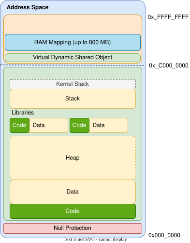

# vDSO
Virtual Dynamic Shared Object

---
layout: two-cols
---
# Address Space
with vDSO

<style>
.two-columns {
    grid-template-columns: 6fr 5fr;
}
</style>

- *kernel memory* that can be read from userspace
- system calls that can run in userspace (examples)
  - `getpid`
  - `gettimeofday`
  - `gettime`
- Linux implements it as an ELF object `libvdso.so`
    - lookable by process loaders

``` {*}{lines: false}
Symbol table '.dynsym' contains 11 entries:
Num: Value   Size Type  Bind   Name
2: ff700600  727 FUNC    WEAK     clock_gettime@@LINUX_2.6
4: ff7008e0  365 FUNC    GLOBAL   __vdso_gettimeofday@@LINUX_2.6
5: ff700a70   61 FUNC    GLOBAL   __vdso_getcpu@@LINUX_2.6
6: ff7008e0  365 FUNC    WEAK     gettimeofday@@LINUX_2.6
7: ff700a50   22 FUNC    WEAK     time@@LINUX_2.6
...
```

::right::


