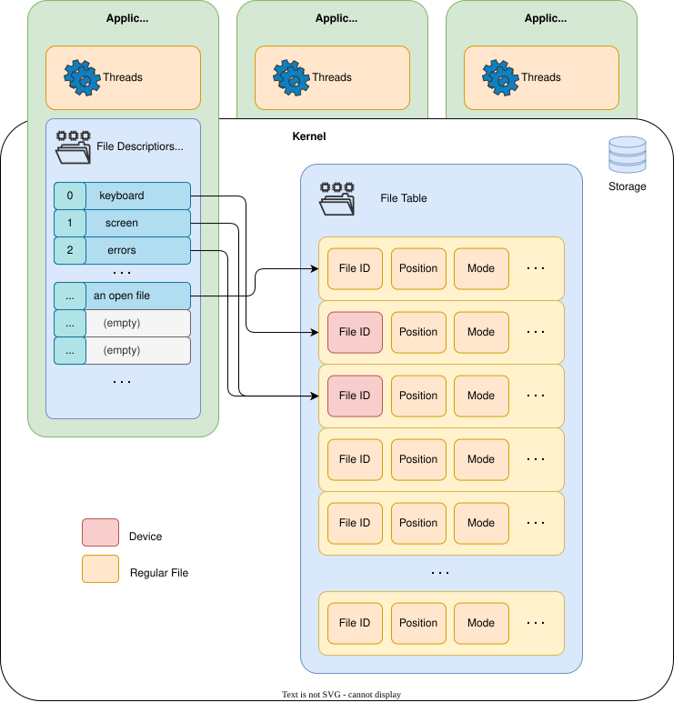

# File Descriptors

---
layout: two-cols
---
# File Descriptor Table
how processes accdess data

- each process has a *File Descriptor Table*
- open files show up in the Table
- the **index** in the table is the **file descriptor**

Special Descriptors

<v-clicks>

- `0` - *keyboard* - `stdin`
- `1` - *display* - `stdout`
- `2` - *error display* - `stderr`

</v-clicks>

:: right ::



---
---
# File Descriptor Inheritrance
how do processes get the file descriptors

- processes inherit (almost) all file descriptors from the parent process due to `fork`
- in between `fork` and `exec`, developers might change some of the file descriptors
  - redirection to and from files (`<`, `>`, `2>`)
  - pipes (`|`)
  - close some files

---
---
# Redirects
trick processes about the keyboard, display and error display

```bash {none|1,2|4,5|7,8|10,11|13,14|16,17|19,20|all}
# Redirect stdout (standard output) to a file
ls > files.txt                      # Save the list of files into files.txt

# Append stdout to a file instead of overwriting it
ls >> files.txt                     # Add more output to files.txt

# Redirect stderr (standard error) to a file
ls /nonexistent 2> errors.txt       # Save only the error message to errors.txt

# Redirect both stdout and stderr to the same file
ls /etc /nonexistent > all.txt 2>&1 # Combine normal output and errors into all.txt

# Shortcut for redirecting both stdout and stderr (Bash 4+)
ls /etc /nonexistent &> all.txt     # Equivalent to the previous command

# Redirect stdin (standard input) from a file
sort < input.txt                    # Read lines from input.txt and sort them

# Redirect stdin and stdout at once
sort < unsorted.txt > sorted.txt    # Sort contents of unsorted.txt into sorted.txt
```

---
---
# Advanced Redirects
trick processes about the keyboard, display and error display

```bash {none|1,2|4,5|7-11}
# Suppress all output (stdout and stderr)
command > /dev/null 2>&1            # Run silently; discard all output and errors

# Redirect stderr to stdout and pipe to another command
command 2>&1 | grep "warning"       # Merge both streams, then search for "warning"

# Use a heredoc (redirect stdin from inline text)
cat <<EOF                           # Start a heredoc input for the 'cat' command
Hello, world!                       # This line is passed to 'cat' as input
This is a heredoc example.          # Another line sent to standard input
EOF                                 # End of heredoc marker
```
