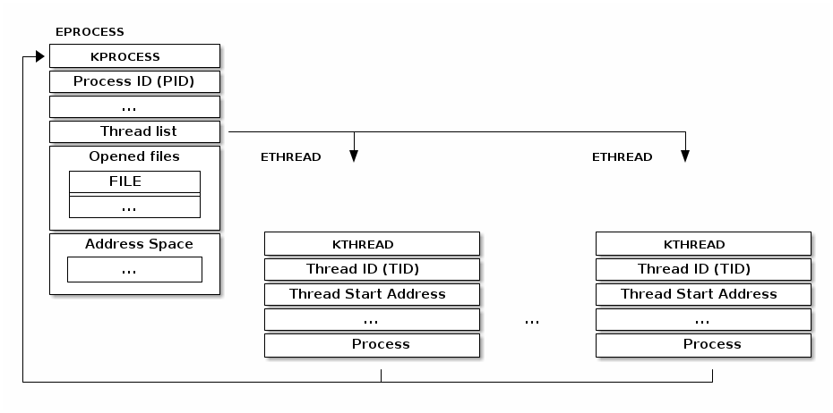
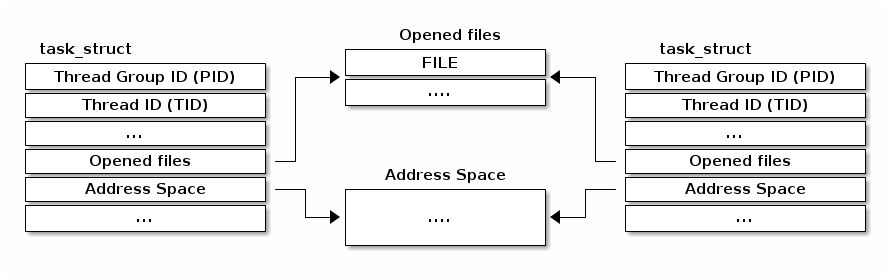
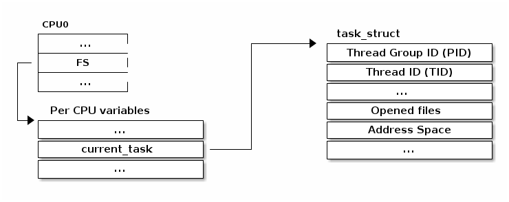
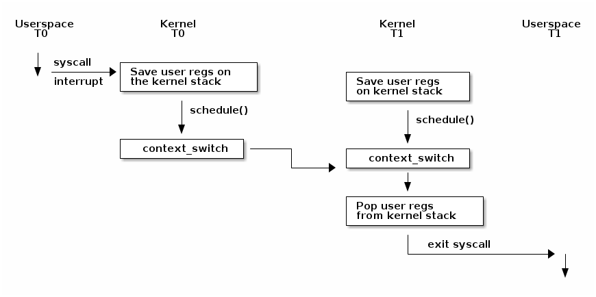
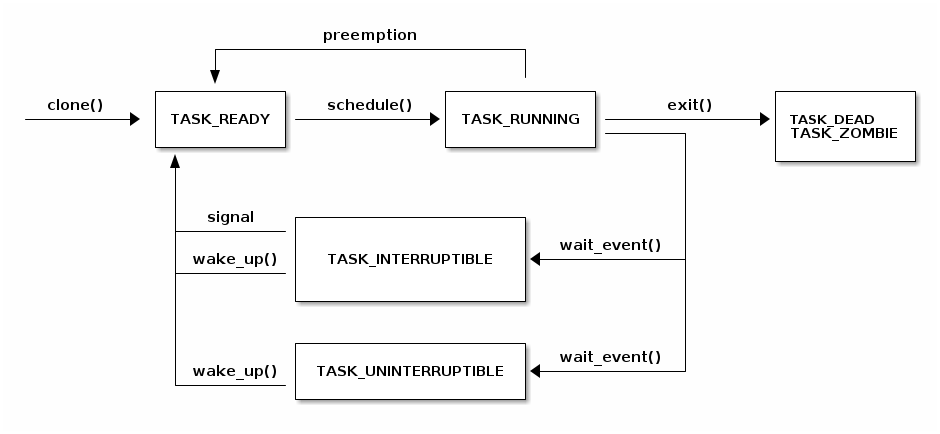

# Processes in Linux

---
---
# Bibliography
for this section

**Daniel P. BOVET & Marco CESATI**, *Understanding the LINUX KERNEL*, 3rd Edition, O'Reilly
- Chapter 3, Processes

---
---
# procfs

<style>
code {
    font-size: 10px;
    line-height: 1px;
}
</style>

```bash {*}{lines: false}
                +-------------------------------------------------------------------+
                | dr-x------    2 tavi tavi 0  2021 03 14 12:34 .                   |
                | dr-xr-xr-x    6 tavi tavi 0  2021 03 14 12:34 ..                  |
                | lrwx------    1 tavi tavi 64 2021 03 14 12:34 0 -> /dev/pts/4     |
           +--->| lrwx------    1 tavi tavi 64 2021 03 14 12:34 1 -> /dev/pts/4     |
           |    | lrwx------    1 tavi tavi 64 2021 03 14 12:34 2 -> /dev/pts/4     |
           |    | lr-x------    1 tavi tavi 64 2021 03 14 12:34 3 -> /proc/18312/fd |
           |    +-------------------------------------------------------------------+
           |                 +----------------------------------------------------------------+             +----------------------------+
           |                 | 08048000-0804c000 r-xp 00000000 08:02 16875609 /bin/cat        |             |  Name: cat                 |
$ ls -1 /proc/self/          | 0804c000-0804d000 rw-p 00003000 08:02 16875609 /bin/cat        |             |  State: R (running)        |
cmdline    |                 | 0804d000-0806e000 rw-p 0804d000 00:00 0 [heap]                 |             |  Tgid: 18205               |
cwd        |                 | ...                                                            |             |  Pid: 18205                |
environ    |    +----------->| b7f46000-b7f49000 rw-p b7f46000 00:00 0                        |    +------->|  PPid: 18133               |
exe        |    |            | b7f59000-b7f5b000 rw-p b7f59000 00:00 0                        |    |        |  Uid: 1000 1000 1000 1000  |
fd --------+    |            | b7f5b000-b7f77000 r-xp 00000000 08:02 11601524 /lib/ld-2.7.so  |    |        |  Gid: 1000 1000 1000 1000  |
fdinfo          |            | b7f77000-b7f79000 rw-p 0001b000 08:02 11601524 /lib/ld-2.7.so  |    |        +----------------------------+
maps -----------+            | bfa05000-bfa1a000 rw-p bffeb000 00:00 0 [stack]                |    |
mem                          | ffffe000-fffff000 r-xp 00000000 00:00 0 [vdso]                 |    |
root                         +----------------------------------------------------------------+    |
stat                                                                                               |     
statm                                                                                              |
status --------------------------------------------------------------------------------------------+    
task            
wchan           
```

---
---
# `struct task_struct`

```cpp
struct task_struct {
    struct thread_info thread_info;                  /*     0     8 */
    volatile long int          state;                /*     8     4 */
    void *                     stack;                /*    12     4 */

    ...

    /* --- cacheline 45 boundary (2880 bytes) --- */
    struct thread_struct thread __attribute__((__aligned__(64))); /*  2880  4288 */

    /* size: 7168, cachelines: 112, members: 155 */
    /* sum members: 7148, holes: 2, sum holes: 12 */
    /* sum bitfield members: 7 bits, bit holes: 2, sum bit holes: 57 bits */
    /* paddings: 1, sum paddings: 2 */
    /* forced alignments: 6, forced holes: 2, sum forced holes: 12 */
} __attribute__((__aligned__(64)));
```

---
---
# Threads (Windows)
how threads should look like

The typical thread implementation is one where the threads are implemented as a separate data structure which is then linked to the process data structure. For example, the *Windows* kernel uses such an implementation:

<div align="center">

</div>

---
---
# Threads
the Linux way

Linux uses a different implementation for threads. The basic unit is called a *task* (hence the `struct task_struct`) and it is used for both threads and processes.

Thus, if two threads are in the same process will point to the same resource structure instance.

If two threads are in different processes they will point to different resource structure instances.

<div align="center">

</div>

---
---
# The `clone` system call
create a process or a thread

In Linux a new thread or process is created with the `clone()` system call. Both the `fork()` system call and the `pthread_create()` function use the `clone()` implementation.

It allows the caller to decide what resources should be shared with the parent and which should be copied or isolated:

<v-clicks>

- `CLONE_FILES` - shares the file descriptor table with the parent
- `CLONE_VM` - shares the address space with the parent
- `CLONE_FS` - shares the filesystem information (root directory, current directory) with the parent
- `CLONE_NEWNS` - does not share the mount namespace with the parent
- `CLONE_NEWIPC` - does not share the IPC namespace (System V IPC objects, POSIX message queues) with the parent
- `CLONE_NEWNET` - does not share the networking namespaces (network interfaces, routing table) with the parent

</v-clicks>

---
---
# Access the current `struct task_struct`
Over 90% of the system calls need to access the current process structure so it needs to be fast

- opening a file needs access to `struct task_struct`'s `file` field
- mapping a new file needs access to `struct task_struct`'s `mm` field

The `current` macro is available to access the current process's `struct task_struct`

<div align="center">

</div>

---
---
# Useful process macro's

```cpp
/* how to get the current stack pointer from C */
register unsigned long current_stack_pointer asm("esp") __attribute_used__;

/* how to get the thread information struct from C */
static inline struct thread_info *current_thread_info(void)
{
   return (struct thread_info *)(current_stack_pointer & ~(THREAD_SIZE – 1));
}

#define current current_thread_info()->task
```

---
---
# Context Switch

<div align="center">

</div>

---
---
# Task States

<div align="center">

</div>
