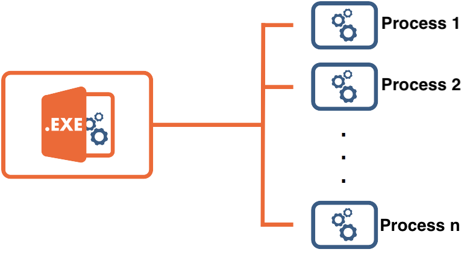
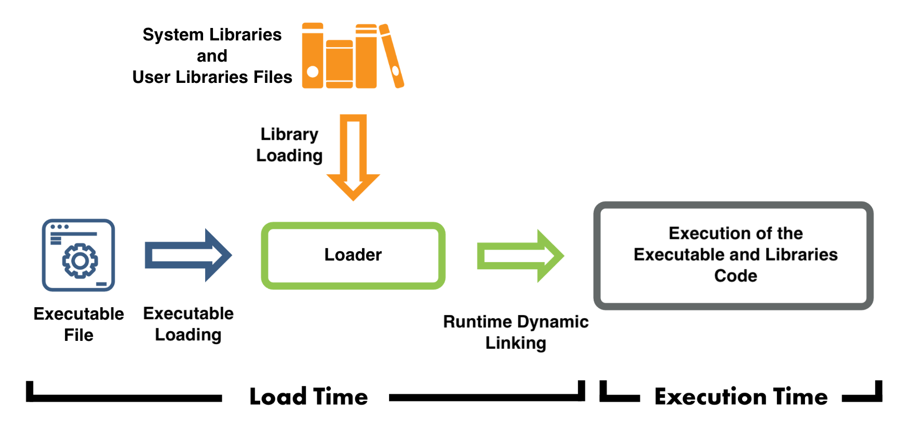
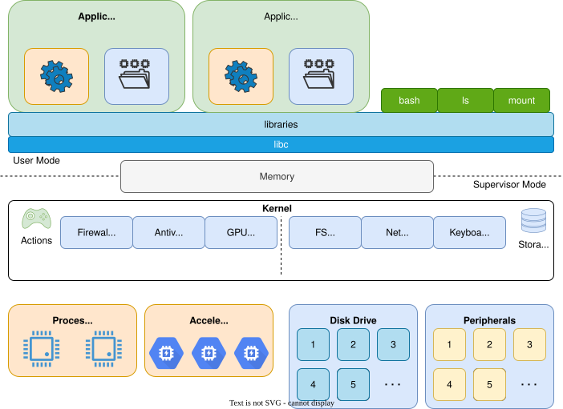
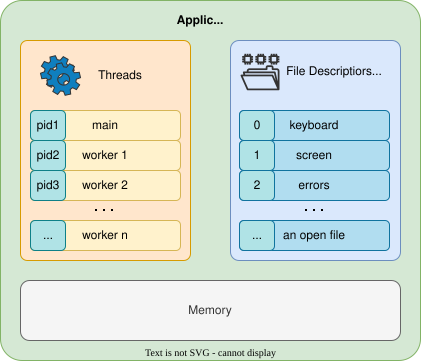
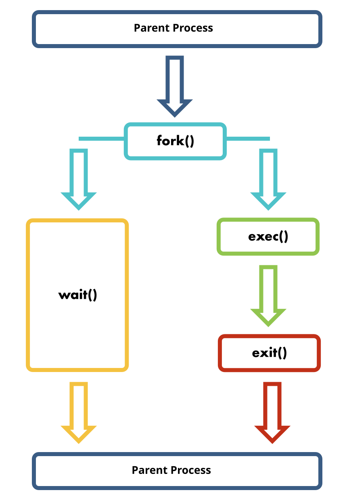
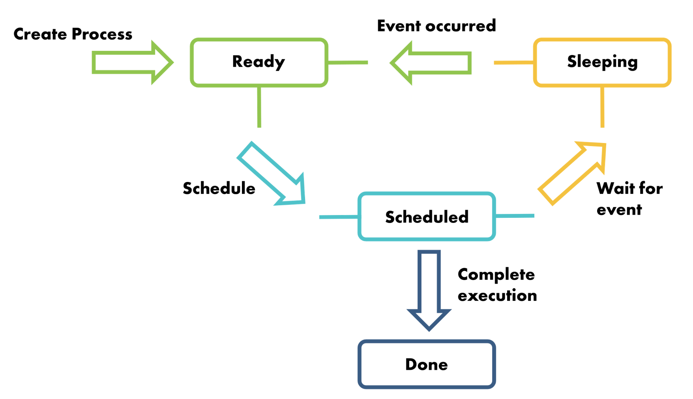

# Process

---
---
# Executable vs Process
*files* to *actions*

📁 one executable file ➡️ multiple processes ⚙️⚙️...⚙️

<center>

</center>

---
---
# Loading an Executable
from *file* to a *process*





---
---
# Process' Resources

<div grid="~ cols-2 gap-5">

<div>

### ⚙️ Actions

- one or multiple threads executing in parallel

<br>

### 💾 Data

- access to files
  - actual files
  - peripheral files (`/dev/...`)

<br>

### Memory
- code
- variables

</div>


<center>

</center>

</div>

---

# Creating a Process
forking a parent and loading an executable

<div grid="~ cols-2 gap-5">

<div>

<v-clicks>

The parent process calls `fork` - *makes a **clone** of the parent*

from now on we have two identical processes

</v-clicks>

**Child**

<v-clicks>

1. Calls `exec` - *replaces the executable*
2. Eventually calls `exit` (or `return` in `main`) and returns an `exit code`

</v-clicks>

**Parent**

<v-clicks>

1. Does other work or *May wait* for the child process
2. Evenutually calles `wait` to read the `exit code` of the child

</v-clicks>

</div>

<center>

</center>

</div>

---
---
# How Linux Starts
the first process

````md magic-move
``` {*}{lines: false}
[PID 0]  swapper / sched
│   # The kernel’s first process (part of the kernel itself)
│   # Manages CPU scheduling and idling
```

``` {*}{lines: false}
[PID 0]  swapper / sched
│   # The kernel’s first process (part of the kernel itself)
│   # Manages CPU scheduling and idling
│
└── [PID 1]  systemd (called init)
      # The first user-space process started by the kernel
      # Responsible for initializing the rest of the system
      # Mounts filesystems, starts targets, and manages services
```

``` {*}{lines: false}
[PID 0]  swapper / sched
│   # The kernel’s first process (part of the kernel itself)
│   # Manages CPU scheduling and idling
│
├── [PID 1]  systemd (called init)
└── [PID ...]  kernel threads (kthreadd, kworker, ksoftirqd, etc.)
      # Internal kernel helpers for scheduling, I/O, and interrupts
      # These run in the background as part of the kernel itself
```

``` {*}{lines: false}
[PID 0]  swapper / sched
│   # The kernel’s first process (part of the kernel itself)
│   # Manages CPU scheduling and idling
│
├── [PID 1]  systemd (called init)
│     ├── [PID 3+]  systemd-udevd
│     │       # Handles dynamic device detection (e.g., USB, disks)
│
└── [PID ...]  kernel threads (kthreadd, kworker, ksoftirqd, etc.)
```

``` {*}{lines: false}
[PID 0]  swapper / sched
│   # The kernel’s first process (part of the kernel itself)
│   # Manages CPU scheduling and idling
│
├── [PID 1]  systemd (called init)
│     ├── [PID 3+]  systemd-udevd
│     ├── [PID 5+]  NetworkManager (or systemd-networkd)
│     │       # Configures and manages network interfaces
│
└── [PID ...]  kernel threads (kthreadd, kworker, ksoftirqd, etc.)
```

``` {*}{lines: false}
[PID 0]  swapper / sched
│   # The kernel’s first process (part of the kernel itself)
│   # Manages CPU scheduling and idling
│
├── [PID 1]  systemd (called init)
│     ├── [PID 3+]  systemd-udevd
│     ├── [PID 5+]  NetworkManager (or systemd-networkd)
│     ├── [PID 8+]  gdm / sddm / lightdm (optional)
│     │       # Display manager – starts graphical login session
│
└── [PID ...]  kernel threads (kthreadd, kworker, ksoftirqd, etc.)
```

``` {*}{lines: false}
[PID 0]  swapper / sched
│   # The kernel’s first process (part of the kernel itself)
│   # Manages CPU scheduling and idling
│
├── [PID 1]  systemd (called init)
│     ├── [PID 3+]  systemd-udevd
│     ├── [PID 5+]  NetworkManager (or systemd-networkd)
│     ├── [PID 8+]  gdm / sddm / lightdm (optional)
│     └── [PID 10+]  user@1000.service
│             # Per-user systemd instance
│             # Manages user-level services after login
└── [PID ...]  kernel threads (kthreadd, kworker, ksoftirqd, etc.)
```

``` {*}{lines: false}
[PID 0]  swapper / sched
│   # The kernel’s first process (part of the kernel itself)
│   # Manages CPU scheduling and idling
│
├── [PID 1]  systemd (called init)
│     ├── [PID 3+]  systemd-udevd
│     ├── [PID 5+]  NetworkManager (or systemd-networkd)
│     ├── [PID 8+]  gdm / sddm / lightdm (optional)
│     └── [PID 10+]  user@1000.service
│             ├── [PID 11+]  bash / zsh / fish
│             │       # User’s shell process after login
└── [PID ...]  kernel threads (kthreadd, kworker, ksoftirqd, etc.)
```

``` {*}{lines: false}
[PID 0]  swapper / sched
│   # The kernel’s first process (part of the kernel itself)
│   # Manages CPU scheduling and idling
│
├── [PID 1]  systemd (called init)
│     ├── [PID 3+]  systemd-udevd
│     ├── [PID 5+]  NetworkManager (or systemd-networkd)
│     ├── [PID 8+]  gdm / sddm / lightdm (optional)
│     └── [PID 10+]  user@1000.service
│             ├── [PID 11+]  bash / zsh / fish
│             ├── [PID 12+]  Xorg / Wayland
│             │       # Graphical display server (for GUI sessions)
└── [PID ...]  kernel threads (kthreadd, kworker, ksoftirqd, etc.)
```

``` {*}{lines: false}
[PID 0]  swapper / sched
│   # The kernel’s first process (part of the kernel itself)
│   # Manages CPU scheduling and idling
│
├── [PID 1]  systemd (called init)
│     ├── [PID 3+]  systemd-udevd
│     ├── [PID 5+]  NetworkManager (or systemd-networkd)
│     ├── [PID 8+]  gdm / sddm / lightdm (optional)
│     └── [PID 10+]  user@1000.service
│             ├── [PID 11+]  bash / zsh / fish
│             ├── [PID 12+]  Xorg / Wayland
│             └── [PID 13+]  gnome-shell / plasma / sway
│                     # User’s desktop environment or window manager
└── [PID ...]  kernel threads (kthreadd, kworker, ksoftirqd, etc.)
```

````

<v-click>

### ⚠️ `init` cannot stop!
or the whole system will panic!

</v-click>

---
---
# Process States
the process from start to finish

<center>

</center>

---
---
# 😕 Orphan Process
what happens when the parent process ends

- child processes remain without a parent
- oprphan processes are reparented to `init` (PID 1)

````md magic-move

```
[PID 1]  systemd (init)
│     # PID 1: init, adopts orphaned processes
│     │
│     ├── [PID 10+]  user@1000.service
│     │     │
│     │     ├── [PID 100]  myapp
│     │     │     # Application master process
│     │     │     │
│     │     │     ├── [PID 200]  myapp-worker
│     │     │     │     # Worker doing background jobs
│     │     │     └── [PID 201]  myapp-helper
│     │     │           # Helper process
...
```

```
[PID 1]  systemd (init)
│     # PID 1: init, adopts orphaned processes
│     │
│     ├── [PID 10+]  user@1000.service
│     ...
├── [PID 200]  myapp-worker    <-- reparented
│     # Was child of PID 100; now adopted by PID 1
├── [PID 201]  myapp-helper    <-- reparented
│     # Also adopted by PID 1
...
```

````

<v-click>

### ⚠️ `init` has to be **present** to be able to reparent processes
or the whole system will panic!

</v-click>

---
---
# 🧟 Zombie Process
and this is why init cannot stop

<v-clicks>

- the process will stay in `Done` / `Terminated` and will **wait for the parent** to *read its return code* (`wait`)
- the system will **keep all the processe's resources allocated** while in `Done`/`Terminated`

</v-clicks>

<center>

</center>

<v-click>

- until reading the return code of the child, **resources** will stay **allocated**, **but not used**, 🧟 zombie

</v-click>

---
---
# 😕 Orphan and 🧟 Zombie ⁉️
uses up resources

### ⚠️ `init` has to be **present** to be able to reparent processes
or the whole system will be full of 🧟 zombies

---
layout: section
---
# 🐧 + 🧟 = 🛑
Linux does not like *permanent* zombies, so it just panics when init stops.
