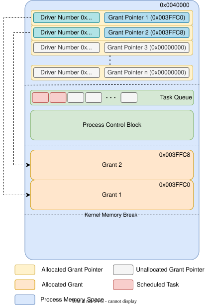
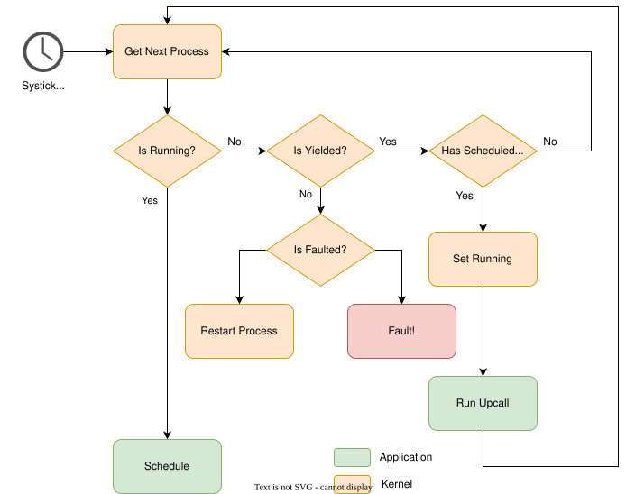
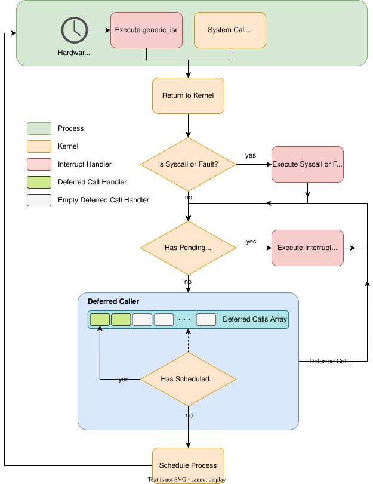

# Processes in Tock

---
---
# Bibliography
for this section

**Alexandru Radovici, Ioana Culic**, *Getting Started with Secure Embedded Systems*
   - Chapter 3 - *The Tock system architecture*

---
layout: two-cols
---
# Process Control Block
information that the kernel keeps about the processes

- the actual *Process Control Block*
- the Task Queue
- Grants pointers
- Grants Data

The PCB is represented by the `Process` trait.

:: right ::



---
---
# `Process` trait
identification

```rust
pub trait Process {
    fn processid(&self) -> ProcessId;

    /// Returns the [`ShortId`] generated by the application binary checker at loading.
    fn short_app_id(&self) -> ShortId;

    /// Returns the version number of the binary in this process, as specified
    /// in a TBF Program Header. If the binary has no version assigned this
    /// returns [`None`].
    fn binary_version(&self) -> Option<BinaryVersion>;

    /// Return the credential which the credential checker approved if the
    /// credential checker approved a credential. If the process was allowed to
    /// run without credentials, return `None`.
    fn get_credential(&self) -> Option<AcceptedCredential>;

    /// Returns how many times this process has been restarted.
    fn get_restart_count(&self) -> usize;

    /// Get the name of the process. Used for IPC.
    fn get_process_name(&self) -> &'static str;
}
```
---
---
# `Process` trait
tasks

```rust
pub trait Process {
    /// Return if there are any Tasks (upcalls/IPC requests) enqueued for the process.
    fn has_tasks(&self) -> bool;

    /// Returns the number of pending tasks.
    fn pending_tasks(&self) -> usize;

    /// Queue a [`Task`] for the process. This will be added to a per-process buffer and executed by the 
    // scheduler. [`Task`]s are some function the process should run, for example a upcall or an IPC call.
    fn enqueue_task(&self, task: Task) -> Result<(), ErrorCode>;

    /// Remove the scheduled operation from the front of the queue and return it
    /// to be handled by the scheduler.
    fn dequeue_task(&self) -> Option<Task>;

    /// Search the work queue for the first pending operation with the given
    /// `upcall_id` and if one exists remove it from the queue.process
    fn remove_upcall(&self, upcall_id: UpcallId) -> Option<Task>;

    /// Remove all scheduled upcalls with the given `upcall_id` from the task queue.
    /// Returns the number of removed upcalls.
    fn remove_pending_upcalls(&self, upcall_id: UpcallId) -> usize;
}
```
---
---
# `Process` trait
state

```rust
pub trait Process {
    /// Returns the current state the process is in.
    fn get_state(&self) -> State;

    fn ready(&self) -> bool;
    fn is_running(&self) -> bool;

    fn set_yielded_state(&self);
    fn set_yielded_for_state(&self, upcall_id: UpcallId);

    fn stop(&self);
    fn resume(&self);

    fn set_fault_state(&self);

    fn start(&self, cap: &dyn crate::capabilities::ProcessStartCapability);
    fn try_restart(&self, completion_code: Option<u32>);

    fn terminate(&self, completion_code: Option<u32>);

    fn get_completion_code(&self) -> Option<Option<u32>>;
}
```

---
---
# `Process` trait
memop

```rust
pub trait Process {
    fn brk(&self, new_break: *const u8) -> Result<CapabilityPtr, Error>;
    fn sbrk(&self, increment: isize) -> Result<CapabilityPtr, Error>;

    fn number_writeable_flash_regions(&self) -> usize;

    fn get_writeable_flash_region(&self, region_index: usize) -> (usize, usize);

    fn update_stack_start_pointer(&self, stack_pointer: *const u8);
    fn update_heap_start_pointer(&self, heap_pointer: *const u8);

    fn build_readwrite_process_buffer(&self, 
        buf_start_addr: *mut u8, size: usize,
    ) -> Result<ReadWriteProcessBuffer, ErrorCode>;
    fn build_readonly_process_buffer(&self,
        buf_start_addr: *const u8, size: usize,
    ) -> Result<ReadOnlyProcessBuffer, ErrorCode>;

    unsafe fn set_byte(&self, addr: *mut u8, value: u8) -> bool;

    fn get_command_permissions(&self, driver_num: usize, offset: usize) -> CommandPermissions;
    fn get_storage_permissions(&self) -> storage_permissions::StoragePermissions;
}
```

---
---
# `Process` trait
memory protection unit

```rust
pub trait Process {
    /// Configure the MPU to use the process's allocated regions.
    fn setup_mpu(&self);

    /// Allocate a new MPU region for the process that is at least
    /// `min_region_size` bytes and lies within the specified stretch of
    /// unallocated memory.
    fn add_mpu_region(
        &self,
        unallocated_memory_start: *const u8,
        unallocated_memory_size: usize,
        min_region_size: usize,
    ) -> Option<mpu::Region>;

    /// Removes an MPU region from the process that has been previously added
    /// with `add_mpu_region`.
    fn remove_mpu_region(&self, region: mpu::Region) -> Result<(), ErrorCode>;
}
```

---
---
# `Process` trait
grant

```rust
pub trait Process {
    fn allocate_grant(&self, grant_num: usize, driver_num: usize, size: usize, align: usize) -> Result<(), ()>;
    fn grant_is_allocated(&self, grant_num: usize) -> Option<bool>;

    fn allocate_custom_grant(&self, 
        size: usize, align: usize
    ) -> Result<(ProcessCustomGrantIdentifier, NonNull<u8>), ()>;

    fn enter_grant(&self, grant_num: usize) -> Result<NonNull<u8>, Error>;
    fn enter_custom_grant(&self, identifier: ProcessCustomGrantIdentifier) -> Result<*mut u8, Error>;

    unsafe fn leave_grant(&self, grant_num: usize);

    fn grant_allocated_count(&self) -> Option<usize>;

    fn lookup_grant_from_driver_num(&self, driver_num: usize) -> Result<usize, Error>;
}
```

---
---
# `Process` trait
subscribe

```rust
pub trait Process {
    /// Verify that an upcall function pointer is within process-accessible
    /// memory.
    fn is_valid_upcall_function_pointer(&self, upcall_fn: *const ()) -> bool;

    /// Set the return value the process should see when it begins executing
    /// again after the syscall.
    fn set_syscall_return_value(&self, return_value: SyscallReturn);
}
```

---
---
# `Process` trait
context switch

```rust
pub trait Process {
    fn set_process_function(&self, callback: FunctionCall);

    /// Set the function that is to be executed when the process is resumed.
    fn switch_to(&self) -> Option<syscall::ContextSwitchReason>;

    fn get_addresses(&self) -> ProcessAddresses;
    fn get_sizes(&self) -> ProcessSizes;

    fn get_stored_state(&self, out: &mut [u8]) -> Result<usize, ErrorCode>;
}
```

---
---
# `Process` trait
debug

```rust
pub trait Process {
    fn print_full_process(&self, writer: &mut dyn Write);

    fn debug_syscall_count(&self) -> usize;
    fn debug_dropped_upcall_count(&self) -> usize;
    fn debug_timeslice_expiration_count(&self) -> usize;

    /// Increment the number of times the process has exceeded its timeslice.
    fn debug_timeslice_expired(&self);

    /// Increment the number of times the process called a syscall and record
    /// the last syscall that was called.
    fn debug_syscall_called(&self, last_syscall: Syscall);

    /// Return the last syscall the process called. Returns `None` if the
    /// process has not called any syscalls or the information is unknown.
    fn debug_syscall_last(&self) -> Option<Syscall>;
}
```

---
---
# `ProcessStandard`
the reference implementation of the `Process` trait

```rust
pub struct ProcessStandard<'a, C: 'static + Chip, D: 'static + ProcessStandardDebug + Default> {
    process_id: Cell<ProcessId>,
    app_id: ShortId,

    memory_start: *const u8,
    memory_len: usize,
    grant_pointers: MapCell<&'static mut [GrantPointerEntry]>,
    kernel_memory_break: Cell<*const u8>,
    app_break: Cell<*const u8>,
    allow_high_water_mark: Cell<*const u8>,

    flash: &'static [u8],

    stored_state:
        MapCell<<<C as Chip>::UserspaceKernelBoundary as UserspaceKernelBoundary>::StoredState>,

    state: Cell<State>,

    tasks: MapCell<RingBuffer<'a, Task>>,

    /* ... */
}
```

---
---
# `ProcessStandard`
the reference implementation of the `Process` trait

```rust
pub struct ProcessStandard<'a, C: 'static + Chip, D: 'static + ProcessStandardDebug + Default> {
    /* ... */
    footers: &'static [u8],
    header: tock_tbf::types::TbfHeader,
    credential: Option<AcceptedCredential>,

    kernel: &'static Kernel,
    chip: &'static C,
    
    fault_policy: &'a dyn ProcessFaultPolicy,
    storage_permissions: StoragePermissions,
    mpu_config: MapCell<<<C as Chip>::MPU as MPU>::MpuConfig>,
    mpu_regions: [Cell<Option<mpu::Region>>; 6],

    

    restart_count: Cell<usize>,
    completion_code: OptionalCell<Option<u32>>,

    debug: D,
}
```

---
---
# `Scheduler` trait

```rust
pub trait Scheduler<C: Chip> {
    fn next(&self) -> SchedulingDecision;
    fn result(&self, result: StoppedExecutingReason, execution_time_us: Option<u32>);

    /// Tell the scheduler to execute kernel work such as interrupt bottom
    /// halves and dynamic deferred calls.
    unsafe fn execute_kernel_work(&self, chip: &C) {
        chip.service_pending_interrupts();
        while DeferredCall::has_tasks() && !chip.has_pending_interrupts() {
            DeferredCall::service_next_pending();
        }
    }

    /// Ask the scheduler whether to take a break from executing userspace
    /// processes to handle kernel tasks.
    unsafe fn do_kernel_work_now(&self, chip: &C) -> bool {
        chip.has_pending_interrupts() || DeferredCall::has_tasks()
    }

    /// Once a process is scheduled the kernel will try to execute it until it
    /// has no more work to do or exhausts its timeslice.
    unsafe fn continue_process(&self, _id: ProcessId, chip: &C) -> bool {
        !(chip.has_pending_interrupts() || DeferredCall::has_tasks())
    }
}
```

---
layout: two-cols
---
# *Default* Scheduling

<div align="center">

</div>

:: right ::

<div align="center">

</div>