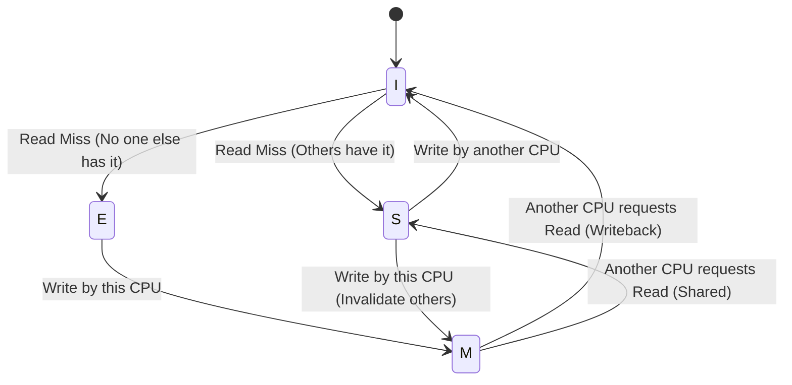

# MESI Cache Coherence Protocol
The **MESI protocol** (Modified, Exclusive, Shared, Invalid) is a **cache coherence protocol** used in **multiprocessor systems** to maintain consistency between caches when multiple CPUs share memory.

---

# MESI Cache States
Each cache line in a processor's cache can be in **one of four states**:

| State      | Meaning |
|------------|---------|
| **M** (Modified) | Cache line is **modified** locally, not in other caches, and differs from main memory. |
| **E** (Exclusive) | Cache line is in only **one cache**, is **clean** (same as main memory), but can be modified later. |
| **S** (Shared) | Cache line is present in **multiple caches**, and is **clean** (same as main memory). |
| **I** (Invalid) | Cache line is **invalid**, meaning it's either unused or needs to be reloaded from memory. |

---

# MESI State Transitions

1. **Read Miss (No other cache has it) → `E` (Exclusive)**  
   - If a CPU reads a memory location **not in its cache**, it fetches it from **main memory** and marks it **Exclusive** (E).
  
2. **Read Miss (Another cache has it) → `S` (Shared)**  
   - If another CPU already has the data, both CPUs **share** it, and the state is set to **Shared (S)**.

3. **Write (In `E` or `M` state) → `M` (Modified)**  
   - If a CPU **writes** to an **Exclusive** (E) cache line, it **modifies** it and marks it **Modified (M)**.

4. **Write (Another cache has it) → `I` (Invalid)**  
   - If another CPU wants to write to a **Shared (S)** cache line, it **invalidates** the copies in other caches.

---

# MESI State Transition Diagram

---

# Advantages of MESI
✅ **Reduces memory traffic** → Only fetches data when necessary.  
✅ **Ensures coherence** → Prevents outdated or incorrect cache data.  
✅ **Optimized performance** → Allows CPUs to read data without unnecessary invalidations.  

---

# Why is MESI Important?
- In **multicore CPUs**, multiple cores access the same memory.  
- Without **MESI**, data inconsistency could lead to **race conditions** and incorrect computations.  
- MESI ensures all CPUs see a **consistent memory view** while **minimizing cache invalidations**.

