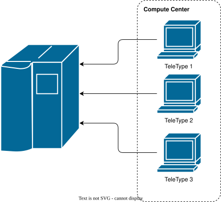
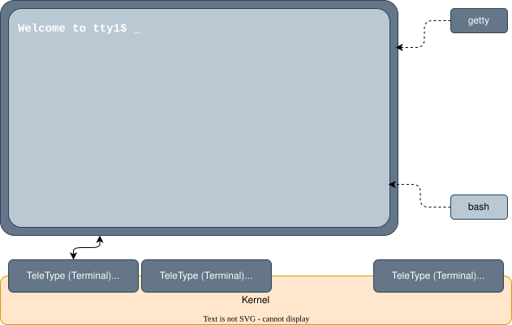
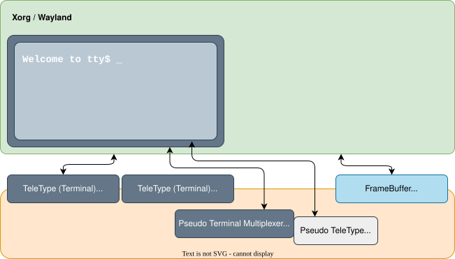
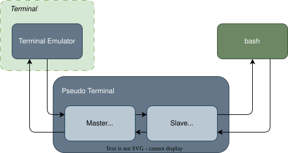

# Terminal &  Shell


---
---
# The *Classic* Terminal



---

# The *Real* Terminal
Text Mode Linux

<div grid="~ cols-[5fr_2fr] gap-5">

<div>



</div>

<div>

````md magic-move
``` {*}{lines: false}
[PID 1]  systemd (called init)
│     # The first user-space
│     # process started by the kernel
│     ...
```

``` {*}{lines: false}
[PID 1]  systemd (called init)
│     # The first user-space
│     # process started by the kernel
|     ...
└── [PID 10+]  agetty
```

``` {*}{lines: false}
[PID 1]  systemd (called init)
│     # The first user-space
│     # process started by the kernel
|     ...
└── [PID 10+]  agetty
    └── [PID 20+]  agetty @ /dev/tty1
                # Login on tty1
```

``` {*}{lines: false}
[PID 1]  systemd (called init)
│     # The first user-space
│     # process started by the kernel
│     ...
└── [PID 10+]  agetty
    ├── [PID 20+]  agetty @ /dev/tty1
    ├── [PID 21+]  agetty @ /dev/tty2
    ├── [PID 22+]  agetty @ /dev/tty3
    ├── [PID 23+]  agetty @ /dev/tty4
    ├── [PID 24+]  agetty @ /dev/tty5
    └── [PID 25+]  agetty @ /dev/tty6
```

``` {*}{lines: false}
[PID 1]  systemd (called init)
│     # The first user-space
│     # process started by the kernel
│     ...
└── [PID 10+]  agetty
    ├── [PID 20+]  agetty @ /dev/tty1
    ├── [PID 21+]  agetty @ /dev/tty2
    ├── [PID 22+]  agetty @ /dev/tty3
    ├── [PID 23+]  agetty @ /dev/tty4
    ├── [PID 24+]  agetty @ /dev/tty5
    ├── [PID 25+]  agetty @ /dev/tty6
    └── [PID 8+]  gdm/sddm/lightdm
               # Graphical Login
```
````

<v-click>

`ALT` + `Fn` to change the terminal

</v-click>

</div>

</div>

---

# The *Virtual* Terminal
Graphical Mode Linux

<div grid="~ cols-[5fr_2fr] gap-5">

<div>



*Xorg* or *Wayland* (UI *servers*) own terminal `/dev/tty1` (print debug) and draw in `/dev/video` (frame buffer)

<v-click>

</v-click>

</div>

<div>

<v-clicks>

### Switch Modes

`CTRL` + `ALT` + `Fn` => text mode

`ALT` + `Fn+1` => graphical mode

</v-clicks>

<v-click>

### Console Application

</v-click>

<v-clicks>

- run in a terminal emulator (`kitty`, `ptyxis`, `alacritty`, ...)
- the terminal emulator inherits `/dev/tty1`
- provides a *pseduo terminal*

</v-clicks>

</div>

</div>

---

# Terminal Emulator
Provide pseudo-terminal

<div grid="~ cols-[3fr_5fr] gap-5">

<div>

<v-click>

`kitty`, `ptyxis`, `alacritty`, ...

</v-click>


<v-clicks>

- inherit `/dev/tty1` (from *Wayland*)
- create a *pseudo-terminal* master (open `/dev/ptmx`)
- draw through *Wayland* output from `/dev/pts/1`
- send input from Wayland to `/dev/pts/1`

</v-clicks>

<v-click>

`bash`, `sh`, `zsh`, ...
- owns the *pseudo-terminal* slave `/dev/pts/1`

</v-click>


</div>

<div align="right">

<v-switch>

<template #1>


</template>

<template #0>



</template>

<template #-1>


</template>

<template #-2>


</template>

<template #-3>


</template>

<template #-6>


</template>

</v-switch>

</div>


</div>

---
---
# Shell
Operating System Interaction

<center>

##  *A process who's main purpose is to allow the interaction with the Operating System*

</center>

<br>

<div grid="~ cols-2 gap-5">

<div>

<v-clicks>

- `cmd`
- `powershell`
- `bash` , `sh` , `zsh`
- `explorer.exe`
- `nautilus`
- `finder`

</v-clicks>

</div>

<div>

<v-clicks>

- `mc`
- `nnn`
- `yazi`
- `Total Commander`
- `Control Panel`
- `Settings`

</v-clicks>

</div>

</div>

---
---
# Foreground and Background Process
the terminal and shell define this

<center>

</center>

---

# Make a Job
a background process


<v-clicks>

- run the command (`$ ...`)
  - ⚠️ make sure you redirect the output as it might write to the same terminal
- press `CTRL`+`Z` (sends `SIGTSTP` - 🙄 process might ignore it)
- find the job `ID` (`$ jobs`)
- run `$ bg %ID`
- run `$ jobs` to verify if it still runs

</v-clicks>

<v-click>

## Bring it back in foreground

- run `$ fg %ID`

</v-click>
