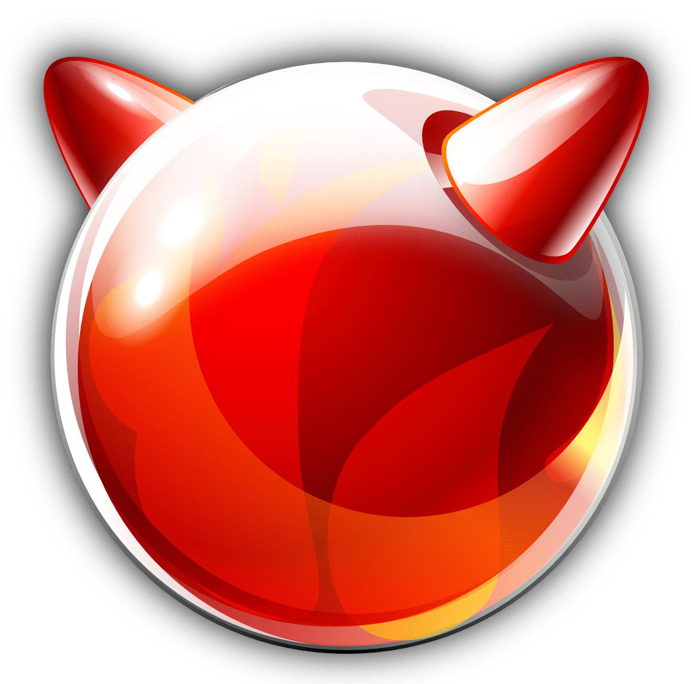
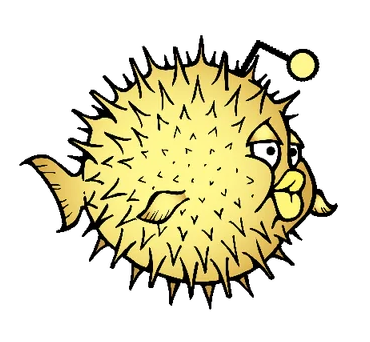
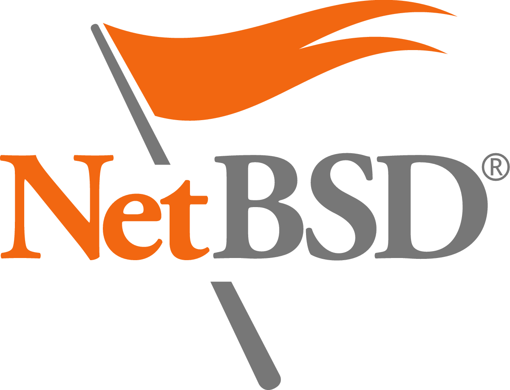
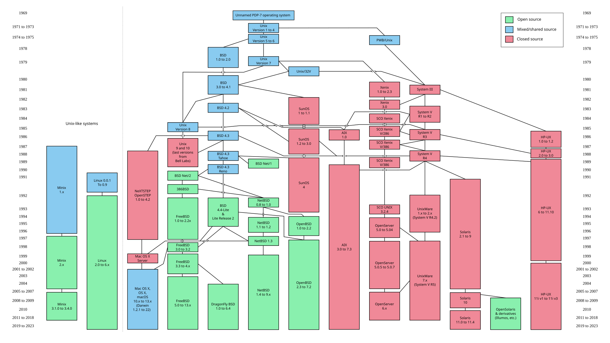
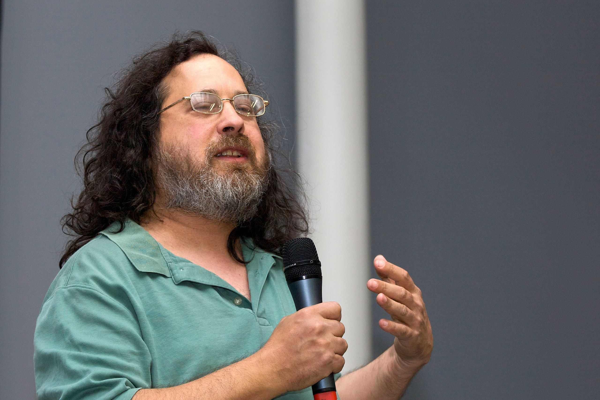
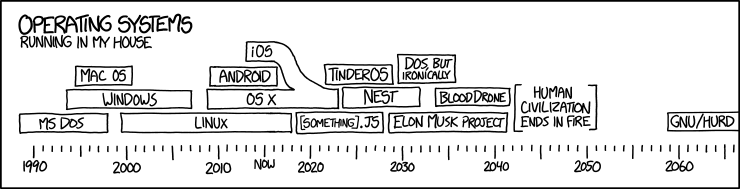

# Distribution
what poeple think an OS is

---
---
# UNIX

- allows several users
  - connect to the mainframe using several terminals
  - run several programs in paralel
- is open source up to version *UNIX System III*

Ken Thompson & Dennis Ritchie (Bell Labs, AT&T)

TODO image

- mainframes provide a lot of hardware
  - needs to be shared by several users
  - each user has a terminal connected to the mainframe
- writes UNIX

---
---
# The POSIX Standard
Portable Operating System Interface

Defines:
  - how an OS should work (*everything is a file*)
  - how the C API looks like (ex `stdio.h`, `unistd.h`)
  - what commands (basic software) should be available

Allows:
  - applications to be portable
    - *in C/C++ source code format only*
 ->

When UNIX became closed source ->

UC **Berkely Software Distribution (BSD)**

| FreeBSD | Darwin | OpenBSD | NetBSD | 
|-|-|-|-|
|  | | | |

New kernels

| **Minix** | **Linux** |
|-|-|
|  |  |

---
---

---
---
# The Linux Kernel

- is the actual operating system
- invisible to the user
  - except when it boots 🏁 and panics 😱
- 25 mil line of code (LOC)
- manages all the system resources

  

  Meet *Tux*

*Linus Torvalds* (University of Helsinky)

  

- did not agree with A Tannenbaum about how Minix should work
- wrote this own 👨‍💻 *POSIX compliant* OS, called it *Linu**x***

---
---
# GNU Software

Basic *UNIX* commands and software **rewritten**
- startup software (`init`)
- most of what we call today [*coreutils*]()
- C Compiler -> GNU Compiler Collection ([`gcc`](https://gcc.gnu.org))
  - C and C++ standard libraries
  - `flex` / `yacc`
- X Windows Systsem ([`x11`](https://www.x.org/wiki/))

**Modern Software**
- *coreutils* are being rewritten in Rust ([*uutils*](https://uutils.github.io))
- `gcc` is being slowly replaced by [LLVM](https://llvm.org)
- `x11` is being replaced by [Wayland](https://wayland.freedesktop.org)

*Richard Stallman* (MIT)

  

  
     
  

His vision is that software should be:
- free to share and modify
- [GPL](https://www.gnu.org/licenses/gpl-3.0.en.html) and [LGPL](https://www.gnu.org/licenses/lgpl-3.0.en.html) licenses
  - allows selling and modifying 
  - modified code must be relicensed under GPL

---
---
# GNU/Linux = ❤️
GNU Software on top of the Linux kernel

- GNU Hurd 👷🚧🏗️ (*work in progress for many many years*)
- The Linux kernel 🐧 still is the *temporary replacement*

---
---
# Which is the most used Linux distribution?

<v-click>
TODO image
</v-click>

---
---
# Base Distributions
The main Linux distributions that started it

*Took the Linux kernel, added the GNU libraries and tools and wrote a package manager to install software*

| | Name | Tagline | Package Format | Package Manager | Release Year |
|-|-|-|-|-|-|
|  | [Slackware](http://www.slackware.com) | *Oldest distribution* | `tgz` | `pkgtool` | 1993 |
| | [Debian](https://www.debian.org) | *Free Software* | `deb` | `apt` / `dpkg` | 1993 |
| | [Red Hat Linux](https://www.redhat.com) | *Enterprise* | `rpm` | `dnf` / `rpm` | 1995 |

These are the base for most of the modern distributions that we have today.

---
---
# Modern Distributions

| | Name | Tagline | Parent | Package Format | Package Manager | Release Year |
|-|-|-|-|-|-|-|
|  | [SUSE Linux](https://www.suse.com) | *Enterprise-grade Linux* | *Originally Slackware, later RPM-based* | `rpm` | `zypper`, `yast` | 1994 |
| | [ArchLinux](https://archlinux.org) | *Minimal Linux* | N/A | `pkg.tar.zst` | `pacman` | 2002 |
|  | [Fedora](https://www.redhat.com) | *Desktop Linux* | *Red Hat Linux renamed* | `rpm` | `dnf` / `rpm` | 2003 |
|  | [Ubuntu](https://www.ubuntu.org) | *Linux for Humans* | Debian | `deb` and `snap` | `apt` / `dpkg` and `snap` | 2004 |
|  | [openSUSE](https://www.opensuse.org) | *Stable, usable Linux for everyone* | SUSE Linux | `rpm` | `zypper`, `rpm` | 2005 |

---
---
# Non GNU Distributions
They use Linux, but most of the software is not from GNU

| | Distribution | Tagline | Parent | Package Format | Package Manager | Release Year |
|-|-|-|-|-|-|-|
|  | [Android](https://source.android.com) | *Mobile Linux platform* | Linux kernel (AOSP) | `.apk` (only Android apps) | AOSP tools (not typical package manager) | 2008 |
|  | [ChromeOS](https://chromeos.google) | *The cloud-first OS* | Gentoo Linux | Custom (`.crx`, `.apk`, others) | `portage`, `cros_sdk`, Flatpak (via Crostini) | 2011 |
