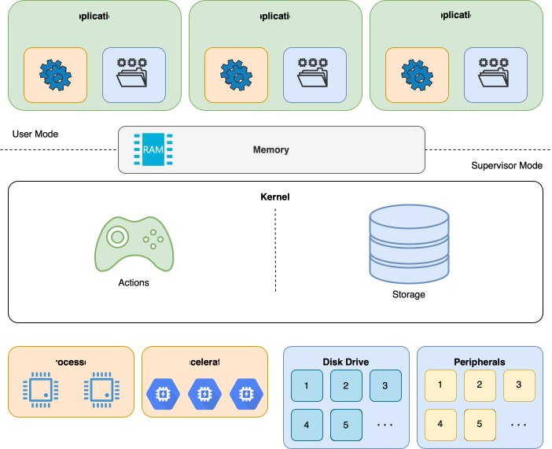
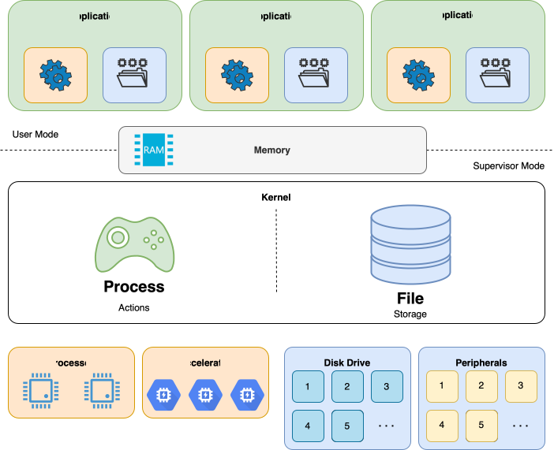
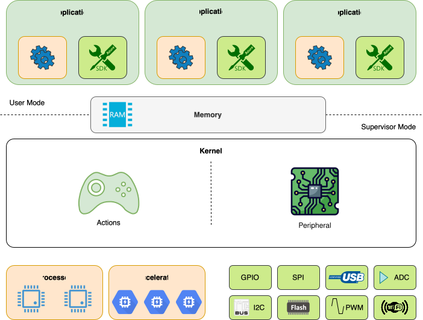
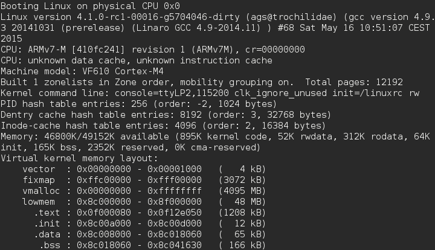
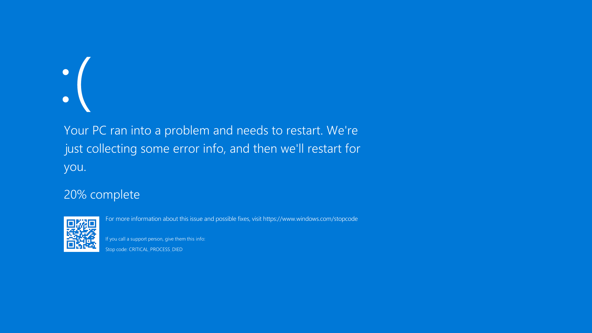
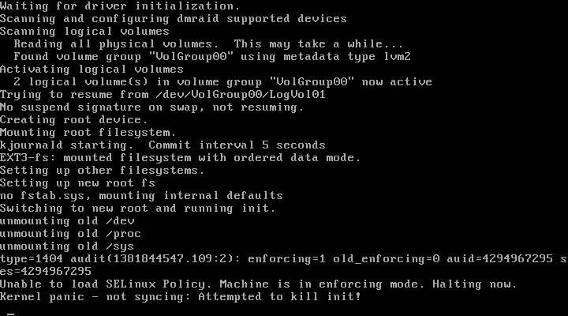
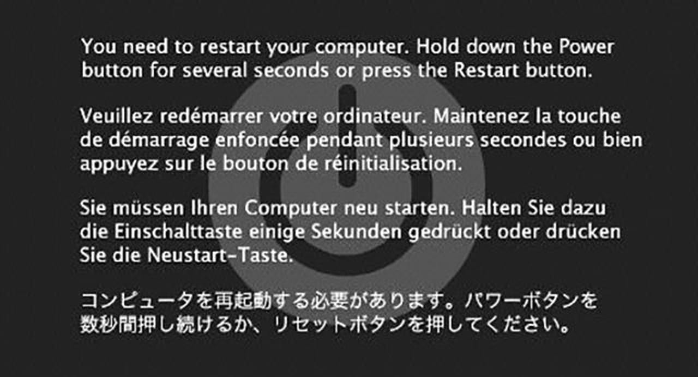
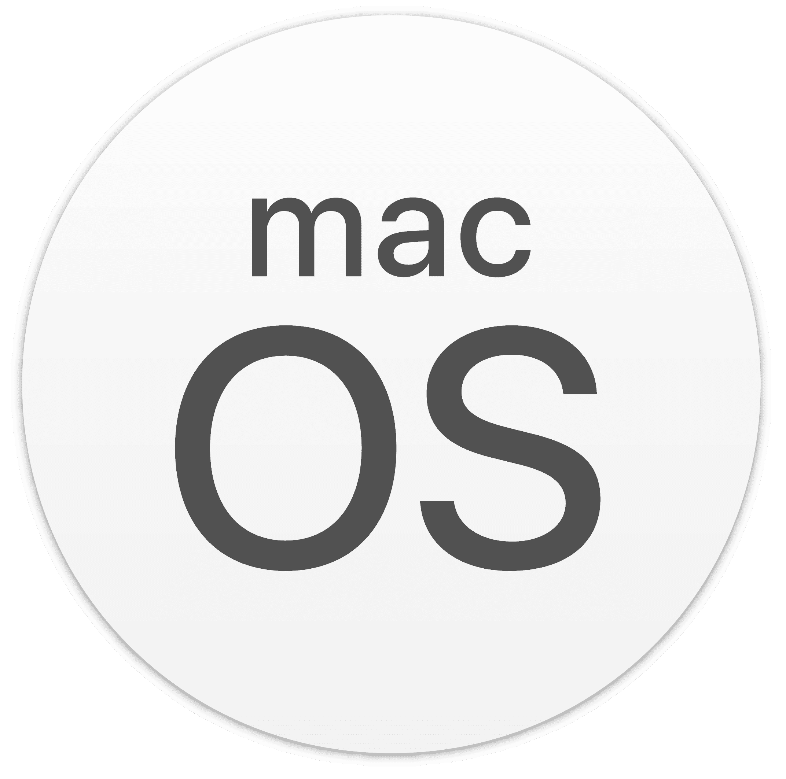
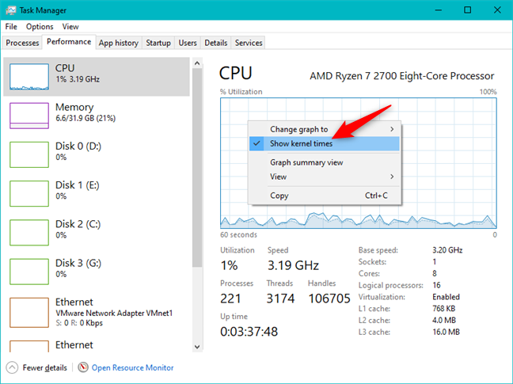
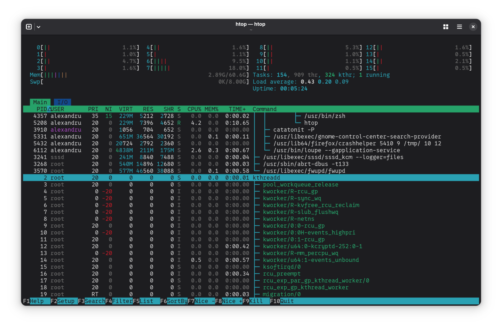

# Operating System
the purpose of an OS

---
layout: two-cols
---
# Operating System
the main role

**Allow Portability**
- provides a hardware independent API
- applications should run on any hardware

**Resources Management and Isolation**
- allow applications to access resources
- prevent applications from accessing hardware directly
- isolate applications

:: right ::

---
layout: two-cols
---
# Desktop and Server Operating Systems
abstractions

**Actions**
- *Applications*
- use the *Processor* and *Accelerators* (GPU, Neural Engine, etc)

**Data**
- everything is a file
- peripherals are viewed as files (*POSIX*)
  - `/dev/input/keyboard` - keyboard
  - `/dev/fb` - screen (framebuffer)
  - `/dev/sda` - Disk Drive A (first)

:: right ::

---
layout: two-cols
---
# Embedded Operating Systems

**Actions**
- Simple *applications*
- use the *Processor* and *Accelerators* (Crypto Engines, Neural Engine, etc)

**Peripheral**
- provide a hardware independent API
- prevent processes from accessing the peripheral

*usually* the applications and the kernel are compiled together into a **single binary**

:: right ::

---
---
# The OS Stack

kernel / libc / libraries / basic tools (commands) / applications

  

---
---
# Application Examples

| What it does | Windows | Linux | macOS |
|-|-|-|-|
| Desktop | `explorer.exe` | [`nautilus`](https://gitlab.gnome.org/GNOME/nautilus) | `Finder` |
| Applications | `taskbar.exe` | [`gnome-shell`](https://gitlab.gnome.org/GNOME/gnome-shell) | `Dock` |
| Files | `explorer.exe` | [`nautilus`](https://gitlab.gnome.org/GNOME/nautilus) | `Finder` |
| Settings | `start ms-settings:` | [`gnome-control-center`](https://gitlab.gnome.org/GNOME/gnome-control-center) | `System Settings` |
| Commands | `cmd.exe` or `powershell.exe` | `bash` or `zsh` | `bash` or `zsh` |
| Documents | `powerpoint.exe` | [`libreoffice`](https://www.libreoffice.org) | `Pages` |
| Edit Code | `code.exe` | `code ` | `code` |
| Terminal | *handled by the OS* | [`ptyxis`](https://gitlab.gnome.org/chergert/ptyxis) | `Terminal` |

---
---
# Where can we see the OS

<v-switch>
  <template #1>

  

    

   During Boot
  

  </template>
  <template #2>

  

    

   Blue Screen
  

  </template>
  <template #3>

  

    

   Linux Kernel Panic
  

  </template>
  <template #4>

  

    

   macOS Kernel Panic
  

  </template>
  <template #5>

  | During Boot | Blue Screen (BSoD) | Kernel Panic |
  |-|-|-|
  |  |  |     |

  </template>
  </v-switch>

---
---
# The Kernel

- is a collection of applications that run in priviliged mode
- one *main application* and several *utilities apps*

<v-switch>
  <template #1>

  

    

  Windows Task Manager
  

  </template>
  <template #2>
  
  

    
    

  `htop`
  

  </template>
</v-switch>

