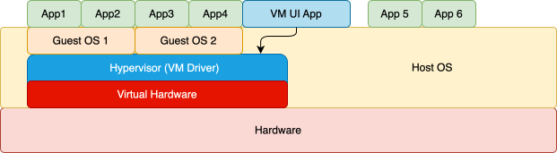
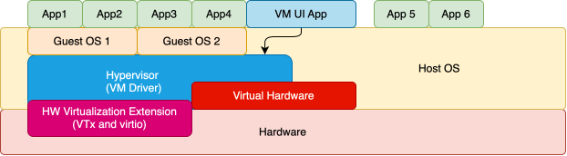

# Virtual Machine
*run an OS within an application*

---
---
# The Idea
*run an operating system within an application*

Why?
- Debug operating systems
- Run software that is not compatible with the OS your computer runs
- Securely share a server

Hypervisors

- VirtualBox
- VMWare
- QEMU

---
---
# Simulation / Emulation
simulate all the hardware - very slow

QEMU

- is able to simulate most of the available architectures
  - most used `x86`, `AMD64`, `arm`, `aarch64`, `powerpc`, `risc-v`

---
layout: two-cols
---
# Virtualization
use a part of the avalable hardware, emulates as if the system was running alone on the hardware

- Requires VT-x (Intel), ... (AMD) and ... (ARM) enabled
- The guest OS has to be built for the same CPU architecture as the host OS
  - *Apple Silicon* is ARM64 (`aarch64`)

:: right ::

## Hypervisors

VMWare

TODO image

VirtualBox

TODO image

QEMU \
via `hyper-v`, `KVM` or TODO macOS

---
---
# Virtual Box
A Virtual Box Machine Settings Example
